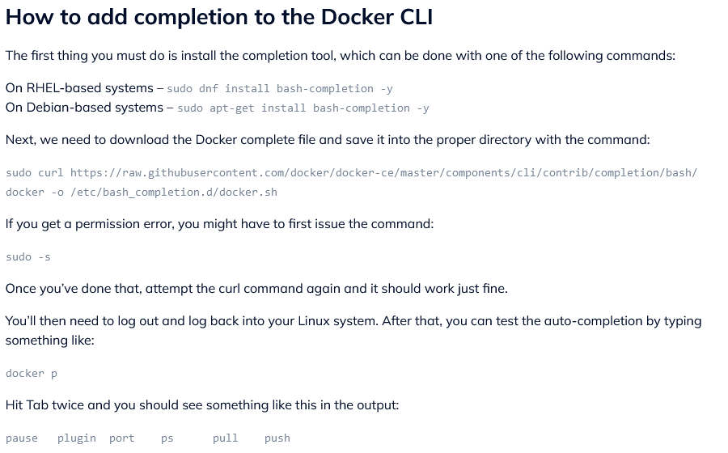

# Docker 

## Cheat Sheet


```docker
sudo apt-get install bash-completion -y
sudo curl https://raw.githubusercontent.com/docker/docker-ce/master/components/cli/contrib/completion/bash/docker -o /etc/bash_completion.d/docker.sh
```
If the above doesn't work, try this as well
```docker
sudo apt-get install bash-completion
sudo curl    https://raw.githubusercontent.com/docker/cli/master/contrib/completion/bash/docker -o /etc/bash_completion.d/docker.sh
```

## Table of Contents

- [Docker Commands](#commands)
- [The Best Way to Set Up Docker for Your OS](#the-best-way-to-set-up-docker-for-your-os)
    - [Docker for Windows 10 Pro/Ent: Setup and Tips](#docker-for-windows-10-proent-setup-and-tips)
    - [Docker Toolbox for Windows 7, 8, and 10 Home: Setup and Tips](#docker-toolbox-for-windows-7-8-and-10-home-setup-and-tips)
    - [Docker for Mac Setup and Tips](#docker-for-mac-setup-and-tips)
    - [Docker for Linux Setup and Tips](#docker-for-linux-setup-and-tips)

- [Creating and Using Containers Like a Boss](#creating-and-using-containers-like-a-boss)
    - [Check Our Docker Install and Config](#check-our-docker-install-and-config)
    - [Starting a Nginx Web Server](#starting-a-nginx-web-server)
    - [Container VS. VM: It's Just a Process](#container-vs-vm-its-just-a-process)
    - [Assignment Answers: Manage Multiple Containers](#assignment-answers-manage-multiple-containers)
    - [What's Going On In Containers: CLI Process Monitoring](#whats-going-on-in-containers-cli-process-monitoring)
    - [Getting a Shell Inside Containers: No Need for SSH](#getting-a-shell-inside-containers-no-need-for-ssh)
      - [Recap: Getting a Shell Inside Containers](#recap-getting-a-shell-inside-containers)
    - [Docker Networks: Concepts for Private and Public Comms in Containers](#docker-networks-concepts-for-private-and-public-comms-in-containers)
      - [Docker Networks Basics and Best Practices](#docker-networks-basics-and-best-practices)
    - [Docker Networks: CLI Management of Virtual Networks](#docker-networks-cli-management-of-virtual-networks)
      - [Docker Networks: CLI Management](#docker-networks-cli-management)
      - [Docker Networks: Default Security](#docker-networks-default-security)
    - [Docker Networks: DNS and How Containers Find Each Other](#docker-networks-dns-and-how-containers-find-each-other)
    - [Assignment Answers: Using Containers for CLI Testing](#assignment-answers-using-containers-for-cli-testing)
    - [Assignment Answers: DNS Round Robin Testing](#assignment-answers-dns-round-robin-testing)

## Commands

- `docker run -d -p 8800:80 httpd`

  - `docker run`: This is the base command used to run a Docker container.
  - `-d`: Run the container in detached mode (in the background).
  - `-p 8800:80`: Map port 8800 on the host to port 80 on the container. This allows you to access the container's web server (if it's running one) via port 8800 on your host machine.
  - `httpd`: The name of the Docker image to use. In this case, it's running an Apache HTTP server.

- `docker ps`: List all running containers. Use the `-a` flag to see all containers, even the ones that are stopped.

- `docker stop <container_id>`: Stop a running container. Replace `<container_id>` with the actual ID or name of the container you want to stop.

- `docker rm <container_id>`: Remove a stopped container. Replace `<container_id>` with the ID or name of the container you want to remove.

- `docker images`: List all Docker images on the host machine.

- `docker rmi <image_id>`: Remove a Docker image from the host machine. Replace `<image_id>` with the actual ID of the image you want to remove.

- `docker pull <image_name>`: Download a Docker image from Docker Hub (or another registry) without running it. Replace `<image_name>` with the name of the image you want to download.

- `docker exec -it <container_id> /bin/bash`: Execute an interactive bash shell inside a running container. Replace `<container_id>` with the ID or name of the container you want to access. Use `/bin/sh` for images that do not have bash.

- `docker logs <container_id>`: Fetch the logs of a container. Replace `<container_id>` with the ID or name of the container whose logs you want to see.

- `docker build -t <tag_name> .`: Build a Docker image from a Dockerfile in the current directory. Replace `<tag_name>` with the name and tag you want to give your image.

# The Best Way to Set Up Docker for Your OS

## Docker for Windows 10 Pro/Ent: Setup and Tips

http://store.docker.com
```docker
docker version
cd .\udemy-docker-mastery\
docker ps
docker info
```
## Docker Toolbox for Windows 7, 8 and 10 Home: Setup and Tips

http://store.docker.com
```docker
cd .\udemy-docker-mastery\
docker-machine ls
docker-machine start
docker-machine ls
docker version
docker version
docker-machine ls
docker-machine help
docker-machine env default
docker version
```
## Docker for Mac Setup and Tips

http://store.docker.com
```docker
docker version
http://github.com/BretFisher/udemy-docker-mastery
docker version
docker container
docker container run --
docker
docker pause
```

## Docker for Linux Setup and Tips
```docker
docker
http://get.docker.com
curl -fsSL get.docker.com -o get-docker.sh
sh get-docker.sh
sudo usermod -aG docker bret
sudo docker version
docker version
sudo docker version
docker-machine version
http://github.com/docker/compose
http://github.com/docker/compose/releases
curl -L https://github.com/docker/compose/releases/download/1.15.0/docker-compose- `uname -s `- `uname -m` >/usr/local/bin/docker-compose
docker-compose version
http://github.com/docker/machine/releases
http://github.com/BretFisher/udemy-docker-mastery
git clone https://github.com/Bretfisher/udemy-docker-mastery.git
cd udemy-docker-mastery/
docker image
docker image ls --
```

# Creating and Using Containers Like a Boss

## Check Our Docker Install and Config

```docker
docker version
docker info
docker
docker container run
docker run
```

## Starting a Nginx Web Server
```docker
# Run a new container using the nginx image and map port 80 of the host to port 80 of the container. Useful for web servers.
docker container run --publish 80:80 nginx

# Similar to the above but runs the container in detached mode (in the background), so the terminal can be used for other commands.
docker container run --publish 80:80 --detach nginx

# List all running containers.
docker container ls

# Stop a container using the first few characters of its ID.
docker container stop 690

# List all running containers again to show the stopped container no longer appears.
docker container ls

# List all containers, including those not running.
docker container ls -a

# Run a new detached nginx container and name it "webhost" for easier reference.
docker container run --publish 80:80 --detach --name webhost nginx

# List all containers to show the newly named container.
docker container ls -a

# View logs of the "webhost" container.
docker container logs webhost

# Show processes running in the last container started (missing container name, generally not a complete command).
docker container top

# Show processes running in the "webhost" container.
docker container top webhost

# Display help for docker container command.
docker container --help

# List all containers again for a current view.
docker container ls -a

# Remove three containers by their ID or names (assuming '63f', '690', 'ode' are container identifiers).
docker container rm 63f 690 ode

# List running containers to show current status.
docker container ls

# Force remove a container by its ID.
docker container rm -f 63f

# List all containers to show the final state.
docker container ls -a
```

## Container VS. VM: It's Just a Process

- Containers are not mini-VMs; they are just processes
- Limited resource access (file paths, network devices, running processes)
- Containers exit when the process stops


```docker
# Run a new container named "mongo" in detached mode using the "mongo" image. This starts a MongoDB server instance.
docker run --name mongo -d mongo

# List all currently running containers to show the "mongo" container is up and running.
docker ps

# Display the running processes of the "mongo" container. Useful for monitoring what's happening inside the container.
docker top mongo

# Stop the "mongo" container, effectively halting the MongoDB server instance running inside.
docker stop mongo

# List all currently running containers again to confirm that the "mongo" container has been stopped.
docker ps

# Attempt to display the running processes of the "mongo" container again, but it will fail since the container is not running.
docker top mongo

# Start the "mongo" container again, resuming the MongoDB server instance.
docker start mongo

# List all currently running containers to verify that the "mongo" container is running again.
docker ps

# Display the running processes of the "mongo" container once more, now that it is running again.
docker top mongo
```

## Assignment Answers: Manage Multiple Containers
```docker
docker container run -d -p 3306:3306 --name db -e MYSQL_RANDOM_ROOT_PASSWORD=yes MYSQL_RANDOM_ROOT_PASSWORD mysql
docker container logs db
docker container run -d --name webserver -p 8080:80 httpd
docker ps
docker container run -d --name proxy -p 80:80 nginx
docker ps
docker container ls
docker container stop TAB COMPLETION
docker ps -a
docker container ls -a
docker container rm TAB COMPLETION
docker ps -a 
docker image ls
```

## What's Going On In Containers: CLI Process Monitoring
```docker
# Docker Commands Notes

## Running Containers
#  Run an Nginx container in detached mode:
docker container run -d --name nginx nginx

# Run a MySQL container in detached mode with a random root password:
docker container run -d --name mysql -e MYSQL_RANDOM_ROOT_PASSWORD=true mysql

## Listing Containers
#  List all running containers:
docker container ls

## Monitoring Containers
#  Show processes running in the `mysql` container:
docker container top mysql

#  Show processes running in the `nginx` container:
docker container top nginx

## Inspecting Containers
#  Inspect the `mysql` container:
docker container inspect mysql

## Container Stats and Help
#  Show help for the `stats` command:
docker container stats --help

#  Display a live stream of container(s) resource usage statistics:
docker container stats

#  Re-list all running containers:
docker container ls
```
```docker
docker container run -d --name nginx nginx
docker container run -d --name mysql -e MYSQL_RANDOM_ROOT_PASSWORD=true mysql
docker container ls
docker container top mysql
docker container top nginx
docker container inspect mysql
docker container stats --help
docker container stats
docker container ls
```

## Getting a Shell Inside Containers: No Need for SSH
```docker
# Docker Command Notes

# Display help for docker container run command
docker container run -help

# Run an Nginx container interactively with a bash shell, naming it proxy
docker container run -it --name proxy nginx bash

# List running containers
docker container ls

# List all containers, including stopped ones
docker container ls -a

# Run an Ubuntu container interactively, naming it ubuntu
docker container run -it --name ubuntu ubuntu

# List running containers again to see the new container
docker container ls

# List all containers again to see all existing containers
docker container ls -a

# Display help for docker container start command
docker container start --help

# Start the Ubuntu container interactively and attach to it
docker container start -ai ubuntu

# Display help for docker container exec command
docker container exec --help

# Execute an interactive bash shell inside the running mysql container
docker container exec -it mysql bash

# List running containers to verify the current status
docker container ls

# Pull the Alpine Linux image from the Docker registry
docker pull alpine

# List all Docker images to see the pulled Alpine image
docker image ls

# Run an Alpine container interactively with a bash shell (bash might not be available, so 'sh' is used instead)
docker container run -it alpine bash

# Run an Alpine container interactively with the default shell (sh)
docker container run -it alpine sh
```

```docker
docker container run -help
docker container run -it --name proxy nginx bash
docker container ls
docker container ls -a
docker container run -it --name ubuntu ubuntu
docker container ls
docker container ls -a
docker container start --help
docker container start -ai ubuntu
docker container exec --help
docker container exec -it mysql bash
docker container ls
docker pull alpine
docker image ls
docker container run -it alpine bash
docker container run -it alpine sh
```
## Recap: Getting a Shell Inside Containers
In Docker, you can interact with containers using the shell in two main ways:

1. `docker container run -it`: This command is used to start a new container interactively. It allows you to interact with the container directly upon its creation. The `-it` flag attaches an interactive terminal to the container's process.

2. `docker container exec -it`: This command is used to run additional commands in an existing container. Similarly, the `-it` flags allow for interactive access to the container's terminal.

It's also worth noting that you can use different Linux distributions as base images for containers, which can be specified in the `docker container run` command by using the appropriate image name (like `ubuntu`, `alpine`, etc.).

## Docker Networks: Concepts for Private and Public Comms in Containers

### Docker Networks Basics and Best Practices

- Each container is connected to a private virtual network called "bridge".
- Each virtual network routes through NAT firewall on host IP.
- All containers on a virtual network can communicate with each other without the need for port mapping (`-p`).
- Best practice is to create a new virtual network for each application:
  - For example, a network named "my_web_app" for MySQL and PHP/Apache containers.
  - A network named "my_api" for MongoDB and Node.js containers.


- The principle of "Batteries Included, But Removable" applies:
  - Docker defaults work well in many cases but are designed to be easily swapped out for customization.
- It is recommended to make new virtual networks for different scopes or requirements.
- Containers can be attached to more than one virtual network or none.
- For direct host communication bypassing virtual networks, use host IP (`--net=host`).
- Different Docker network drivers can be used to gain new abilities and functionalities.
- There are many more networking features and options available in Docker.

```docker
docker container run -p 80:80 --name webhost -d nginx
docker container port webhost
docker container inspect --format '{{ .NetworkSettings.IPAddress }}' webhost
```

## Docker Networks: CLI Management of Virtual Networks
### Docker Networks: CLI Management
- Show all networks: `docker network ls`
- Inspect a specific network: `docker network inspect`
- Create a new network with a specified driver: `docker network create --driver`
- Attach a network to a container: `docker network connect`
- Detach a network from a container: `docker network disconnect`

### Docker Networks: Default Security
- Design your applications so that the frontend and backend are on the same Docker network.
- Inter-container communication never leaves the host, enhancing security.
- All externally exposed ports are closed by default.
- Ports must be manually exposed using `-p`, providing better default security.
- Security features are further improved with Docker Swarm and Overlay networks.

```docker
# List all networks currently available in Docker
docker network ls

# Inspect the default 'bridge' network to view its configuration and connected containers
docker network inspect bridge

# List networks again, useful to check the list after creating or removing networks
docker network ls

# Create a new network with the name 'my_app_net' for your app's containers
docker network create my_app_net

# List networks to verify that 'my_app_net' has been created
docker network ls

# Get help for the 'docker network create' command to understand all options
docker network create --help

# Run a new Nginx container and connect it to 'my_app_net' network
docker container run -d --name new_nginx --network my_app_net nginx

# Inspect 'my_app_net' to verify the Nginx container is correctly connected
docker network inspect my_app_net

# Display help for 'docker network' commands
docker network --help

# Connect a container to a network (use the actual container name and network name)
docker network connect [network] [container]

# Inspect a container's network settings (use TAB COMPLETION to fill the container's name)
docker container inspect [container]

# Disconnect a container from a network (use TAB COMPLETION to fill the container's name and network name)
docker network disconnect [network] [container]

# Inspect a container to check its current network status
docker container inspect [container]

```
```docker
docker network ls
docker network inspect bridge
docker network ls
docker network create my_app_net
docker network ls
docker network create --help
docker container run -d --name new_nginx --network my_app_net nginx
docker network inspect my_app_net
docker network --help
docker network connect
docker container inspect TAB COMPLETION
docker container disconnect TAB COMPLETION
docker container inspect
```

## Docker Networks: DNS and How Containers Find Each Other
### Docker Networks: DNS

- Docker uses an internal DNS server to provide service discovery for containers. This is the key to easy inter-container communication.

- By default, custom networks facilitate DNS by allowing containers to refer to each other by names.

- To enable Docker's internal DNS on the default bridge network, you need to explicitly link containers using the `--link` flag when you run them.

### Key Points:

- Containers should not rely on IP addresses for inter-communication because Docker assigns IP addresses dynamically, and they can change on container restarts.

- Docker's internal DNS (Docker Internal DNS or DID) for friendly names is built-in if you use custom networks. This means containers on the same network can communicate using container names instead of IP addresses.

- It's a best practice to use custom networks with Docker for DNS resolution and better network isolation.

- The process of managing networks and DNS becomes much more straightforward when using Docker Compose, which will be covered in a future section.

Note: A recent June 2017 change in the official nginx image https://hub.docker.com/_/nginx (nginx  or nginx:latest ) removes ping, but I use it in the next few videos to test connectivity, so you might get an error about "ping not found". I'm working on updates to those videos but until I can get them processed and uploaded, just do this:

Anywhere I do a docker container run <stuff> nginx , where nginx  is the image you should use, replace that with nginx:alpine , which still has ping command in it.

There are other ways to solve this, including adding the ping util with apt-get, making your own image, etc.  

```bash
docker container exec -it new_nginx
apt-get update -y
apt-get install -y iputils-ping
```


```docker
# List all running containers
docker container ls

# Inspect a network configuration, use TAB completion to autofill the network name
docker network inspect [network_name]

# Run a new container named 'my_nginx' in detached mode on 'my_app_net' network using the nginx image
docker container run -d --name my_nginx --network my_app_net nginx

# Inspect a container's configuration, use TAB completion to autofill the container name
docker container inspect [container_name]

# Execute an interactive ping command from 'my_nginx' container to 'new_nginx' to test connectivity
docker container exec -it my_nginx ping new_nginx

# Similarly, test connectivity in the other direction, from 'new_nginx' to 'my_nginx'
docker container exec -it new_nginx ping my_nginx

# List all networks to view current network configurations
docker network ls

# Display help for 'docker container create' command to understand all options
docker container create --help
```

```docker
docker container ls
docker network inspect TAB COMPLETION
docker container run -d --name my_nginx --network my_app_net nginx
docker container inspect TAB COMPLETION
docker container exec -it my_nginx ping new_nginx
docker container exec -it new_nginx ping my_nginx
docker network ls
docker container create --help
```

## Assignment Answers: Using Containers for CLI Testing
```docker
# Run a CentOS 7 container interactively with a Bash shell and remove the container after exit
docker container run --rm -it centos:7 bash

# List all containers, both running and stopped
docker ps -a

# Run an Ubuntu 14.04 container interactively with a Bash shell and remove the container after exit
docker container run --rm -it ubuntu:14.04 bash

# List all containers again to see the status after running Ubuntu
docker ps -a
```

```docker
docker container run --rm -it centos:7 bash
docker ps -a
docker container run --rm -it ubuntu:14.04 bash
docker ps -a
```

## Assignment Answers: DNS Round Robin Testing
```docker
# Create a new network named 'dude'
docker network create dude

# Run an Elasticsearch version 2 container in detached mode, connected to the 'dude' network with a network alias 'search'
docker container run -d --net dude --net-alias search elasticsearch:2

# List all running containers to verify the Elasticsearch container is running
docker container ls

# Run an alpine container that performs an nslookup on 'search', which is the network alias of Elasticsearch
docker container run --rm --net dude alpine nslookup search

# Run a centos container that performs a curl request to 'search:9200', which communicates with Elasticsearch over the 'dude' network
docker container run --rm --net dude centos curl -s search:9200

# List all running containers again, if needed for context before removing containers
docker container ls

# Remove a running container forcefully using the container ID or name, with TAB COMPLETION to autofill
docker container rm -f [container_id_or_name]

```

```docker
docker network create dude
docker container run -d --net dude --net-alias search elasticsearch:2
docker container ls
docker container run --rm --net dude alpine nslookup search
docker container run --rm --net dude centos curl -s search:9200
docker container ls
docker container rm -f TAB COMPLETION
```