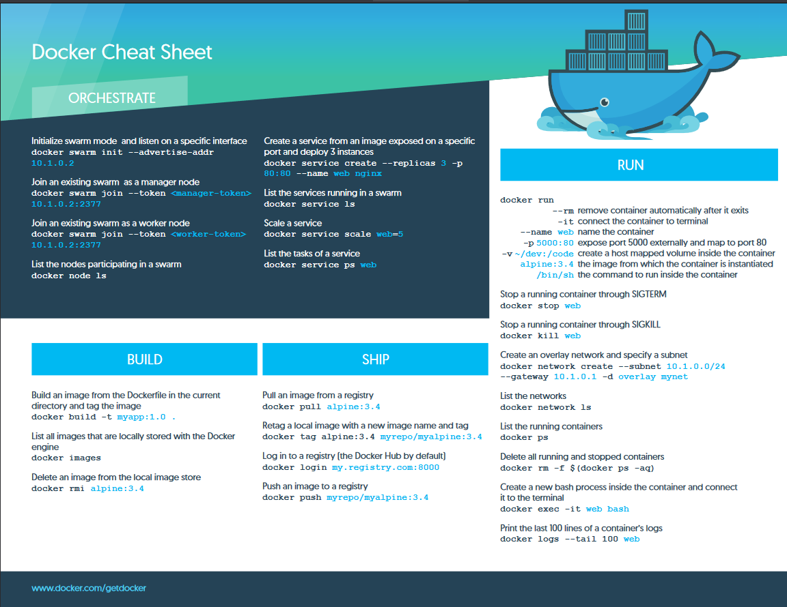

# Docker 

## Cheat Sheet


## Table of Contents

- [Docker Commands](#commands)
- [The Best Way to Set Up Docker for Your OS](#the-best-way-to-set-up-docker-for-your-os)
    - [Docker for Windows 10 Pro/Ent: Setup and Tips](#docker-for-windows-10-proent-setup-and-tips)
    - [Docker Toolbox for Windows 7, 8, and 10 Home: Setup and Tips](#docker-toolbox-for-windows-7-8-and-10-home-setup-and-tips)
    - [Docker for Mac Setup and Tips](#docker-for-mac-setup-and-tips)
    - [Docker for Linux Setup and Tips](#docker-for-linux-setup-and-tips)

- [Creating and Using Containers Like a Boss](#creating-and-using-containers-like-a-boss)
    - [Check Our Docker Install and Config](#check-our-docker-install-and-config)
    - [Starting a Nginx Web Server](#starting-a-nginx-web-server)
    - [Container VS. VM: It's Just a Process](#container-vs-vm-its-just-a-process)
    - [Assignment Answers: Manage Multiple Containers](#assignment-answers-manage-multiple-containers)
    - [What's Going On In Containers: CLI Process Monitoring](#whats-going-on-in-containers-cli-process-monitoring)
    - [Getting a Shell Inside Containers: No Need for SSH](#getting-a-shell-inside-containers-no-need-for-ssh)
    - [Docker Networks: Concepts for Private and Public Comms in Containers](#docker-networks-concepts-for-private-and-public-comms-in-containers)
    - [Docker Networks: CLI Management of Virtual Networks](#docker-networks-cli-management-of-virtual-networks)
    - [Docker Networks: DNS and How Containers Find Each Other](#docker-networks-dns-and-how-containers-find-each-other)
    - [Assignment Answers: Using Containers for CLI Testing](#assignment-answers-using-containers-for-cli-testing)
    - [Assignment Answers: DNS Round Robin Testing](#assignment-answers-dns-round-robin-testing)

## Commands

- `docker run -d -p 8800:80 httpd`

  - `docker run`: This is the base command used to run a Docker container.
  - `-d`: Run the container in detached mode (in the background).
  - `-p 8800:80`: Map port 8800 on the host to port 80 on the container. This allows you to access the container's web server (if it's running one) via port 8800 on your host machine.
  - `httpd`: The name of the Docker image to use. In this case, it's running an Apache HTTP server.

- `docker ps`: List all running containers. Use the `-a` flag to see all containers, even the ones that are stopped.

- `docker stop <container_id>`: Stop a running container. Replace `<container_id>` with the actual ID or name of the container you want to stop.

- `docker rm <container_id>`: Remove a stopped container. Replace `<container_id>` with the ID or name of the container you want to remove.

- `docker images`: List all Docker images on the host machine.

- `docker rmi <image_id>`: Remove a Docker image from the host machine. Replace `<image_id>` with the actual ID of the image you want to remove.

- `docker pull <image_name>`: Download a Docker image from Docker Hub (or another registry) without running it. Replace `<image_name>` with the name of the image you want to download.

- `docker exec -it <container_id> /bin/bash`: Execute an interactive bash shell inside a running container. Replace `<container_id>` with the ID or name of the container you want to access. Use `/bin/sh` for images that do not have bash.

- `docker logs <container_id>`: Fetch the logs of a container. Replace `<container_id>` with the ID or name of the container whose logs you want to see.

- `docker build -t <tag_name> .`: Build a Docker image from a Dockerfile in the current directory. Replace `<tag_name>` with the name and tag you want to give your image.

# The Best Way to Set Up Docker for Your OS

## Docker for Windows 10 Pro/Ent: Setup and Tips

http://store.docker.com
```docker
docker version
cd .\udemy-docker-mastery\
docker ps
docker info
```
## Docker Toolbox for Windows 7, 8 and 10 Home: Setup and Tips

http://store.docker.com
```docker
cd .\udemy-docker-mastery\
docker-machine ls
docker-machine start
docker-machine ls
docker version
docker version
docker-machine ls
docker-machine help
docker-machine env default
docker version
```
## Docker for Mac Setup and Tips

http://store.docker.com
```docker
docker version
http://github.com/BretFisher/udemy-docker-mastery
docker version
docker container
docker container run --
docker
docker pause
```

## Docker for Linux Setup and Tips
```docker
docker
http://get.docker.com
curl -fsSL get.docker.com -o get-docker.sh
sh get-docker.sh
sudo usermod -aG docker bret
sudo docker version
docker version
sudo docker version
docker-machine version
http://github.com/docker/compose
http://github.com/docker/compose/releases
curl -L https://github.com/docker/compose/releases/download/1.15.0/docker-compose- `uname -s `- `uname -m` >/usr/local/bin/docker-compose
docker-compose version
http://github.com/docker/machine/releases
http://github.com/BretFisher/udemy-docker-mastery
git clone https://github.com/Bretfisher/udemy-docker-mastery.git
cd udemy-docker-mastery/
docker image
docker image ls --
```

# Creating and Using Containers Like a Boss

## Check Our Docker Install and Config

```docker
docker version
docker info
docker
docker container run
docker run
```

## Starting a Nginx Web Server
```docker
docker container run --publish 80:80 nginx
docker container run --publish 80:80 --detach nginx
docker container ls
docker container stop 690
docker container ls
docker container ls -a
docker container run --publish 80:80 --detach --name webhost nginx
docker container ls -a
docker container logs webhost
docker container top
docker container top webhost
docker container --help
docker container ls -a
docker container rm 63f 690 ode
docker container ls
docker container rm -f 63f
docker container ls -a
```

## Container VS. VM: It's Just a Process
```docker
docker run --name mongo -d mongo
docker ps
docker top mongo
docker stop mongo
docker ps
docker top mongo
docker start mongo
docker ps
docker top mongo
```

## Assignment Answers: Manage Multiple Containers
```docker
docker container run -d -p 3306:3306 --name db -e MYSQL_RANDOM_ROOT_PASSWORD=yes MYSQL_RANDOM_ROOT_PASSWORD
docker container logs db
docker container run -d --name webserver -p 8080:80 httpd
docker ps
docker container run -d --name proxy -p 80:80 nginx
docker ps
docker container ls
docker container stop TAB COMPLETION
docker ps -a
docker container ls -a
docker container rm
docker ps -a
docker image ls
```

## What's Going On In Containers: CLI Process Monitoring
```docker
docker container run -d --name nginx nginx
docker container run -d --name mysql -e MYSQL_RANDOM_ROOT_PASSWORD=true mysql
docker container ls
docker container top mysql
docker container top nginx
docker container inspect mysql
docker container stats --help
docker container stats
docker container ls
```

## Getting a Shell Inside Containers: No Need for SSH
```docker
docker container run -help
docker container run -it --name proxy nginx bash
docker container ls
docker container ls -a
docker container run -it --name ubuntu ubuntu
docker container ls
docker container ls -a
docker container start --help
docker container start -ai ubuntu
docker container exec --help
docker container exec -it mysql bash
docker container ls
docker pull alpine
docker image ls
docker container run -it alpine bash
docker container run -it alpine sh
```

## Docker Networks: Concepts for Private and Public Comms in Containers
```docker
docker container run -p 80:80 --name webhost -d nginx
docker container port webhost
docker container inspect --format '{{ .NetworkSettings.IPAddress }}' webhost
```

## Docker Networks: CLI Management of Virtual Networks
```docker
docker network ls
docker network inspect bridge
docker network ls
docker network create my_app_net
docker network ls
docker network create --help
docker container run -d --name new_nginx --network my_app_net nginx
docker network inspect my_app_net
docker network --help
docker network connect
docker container inspect TAB COMPLETION
docker container disconnect TAB COMPLETION
docker container inspect
```

## Docker Networks: DNS and How Containers Find Each Other
```docker
docker container ls
docker network inspect TAB COMPLETION
docker container run -d --name my_nginx --network my_app_net nginx
docker container inspect TAB COMPLETION
docker container exec -it my_nginx ping new_nginx
docker container exec -it new_nginx ping my_nginx
docker network ls
docker container create --help
```

## Assignment Answers: Using Containers for CLI Testing
```docker
docker container run --rm -it centos:7 bash
docker ps -a
docker container run --rm -it ubuntu:14.04 bash
docker ps -a
```

## Assignment Answers: DNS Round Robin Testing
```docker
docker network create dude
docker container run -d --net dude --net-alias search elasticsearch:2
docker container ls
docker container run --rm --net dude alpine nslookup search
docker container run --rm --net dude centos curl -s search:9200
docker container ls
docker container rm -f TAB COMPLETION
```