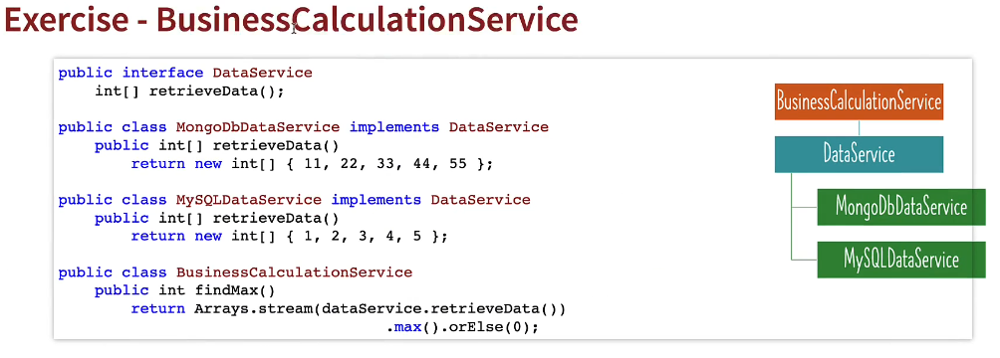
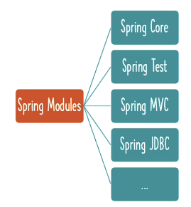
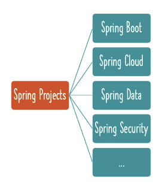
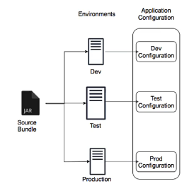
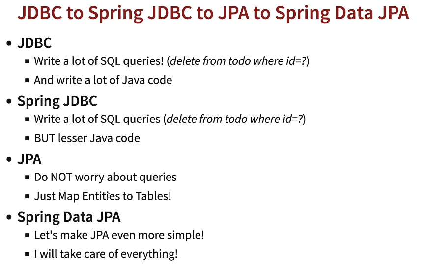

# Spring Boot 3 and Spring Framework 6

## Table of Contents
- [Terminology](#terminology)
  - [Tightly Coupled Code](#tightly-coupled-code)
  - [Loosely Coupled Code](#loosely-coupled-code)
  - [Annotations and Descriptions](#annotations-and-descriptions)
  - [Important Spring Concepts](#important-spring-concepts)
- [Spring Core](#spring-core)
  - [Understanding Dependencies in Spring](#understanding-dependencies-in-spring)
  - [When to Use `@Autowired`](#using-autowired-in-spring)
  - [Simple Spring Bean](#simple-spring-bean)
  - [Auto Created Spring Bean](#auto-created-spring-bean)
  - [`@Primary` vs `@Qualifier`](#primary-vs-qualifier---which-one-to-use)
  - [`@Component` vs `@Bean`](#component-vs-bean)
  - [Lazy vs Eager Initialization](#comparing-lazy-initialization-vs-eager-initialization)
  - [Bean Scopes - Prototype and Singleton](#bean-scopes---prototype-and-singleton)
  - [Spring Boot `@PreConstruct` and `@PostDestroy` Annotations](#spring-boot-preconstruct-and-postdestroy-annotations)
  - [Evolution of Jakarta EE: vs J2EE vs Java EE](#evolution-of-jakarta-ee-vs-j2ee-vs-java-ee)
  - [Jakarta Contexts & Dependency Injection (CDI)](#jakarta-contexts--dependency-injection-cdi)
  - [Spring Stereotype Annotations - `@Component` & more..](#spring-stereotype-annotations---component--more)
  - [Annotations and Descriptions Review](#annotations-and-descriptions-review)
  - [Important Spring Concepts Review](#important-spring-concepts-review)
- [Spring Framework](#spring-framework)
  - [Spring Big Picture - Framework and Modules](#spring-big-picture---framework-and-modules)
  - [Spring Big Picture - Spring Projects](#spring-big-picture---spring-projects)
  - [Spring Big Picture - Framework, Modules and Projects](#spring-big-picture---framework-modules-and-projects)
- [Spring Boot](#spring-boot)
  - [Getting Started with Spring Boot - Approach](#getting-started-with-spring-boot---approach)
  - [Goal of Spring Boot](#goal-of-spring-boot)
  - [Spring Boot Starter Projects](#exploring-spring-boot-starter-projects)
  - [Spring Boot Auto Configuration](#exploring-spring-boot-auto-configuration)
  - [Spring Boot Devtools](#build-faster-with-spring-boot-devtools)
  - [Profiles in Spring Boot](#managing-app-configuration-using-profiles)
  - [Spring Boot Actuator](#why-is-actuator-important)
  - [Spring Ecosystem Review](#understanding-spring-boot-vs-spring-mvc-vs-spring-review)
- [JPA and Hibernate](#jpa-and-hibernate)
    - [Learning JPA and Hibernate with Spring Boot](#learning-jpa-and-hibernate---approach)
    - [JDBC vs Spring JDBC vs JPA vs Spring Data JPA](#jdbc-to-spring-jdbc-to-jpa-to-spring-data-jpa)
    - [Hardcoded Spring JDBC Insertion Example](#hardcoded-spring-jdbc-entry)
    - [Dynamic JDBC Queries](#dynamic-jdbc-queries)
    - [JPA Integration in Spring Boot](#jpa-integration-in-spring-boot)
    - [Spring Data JPA](#spring-data-jpa-integration)
    - [Hibernate vs JPA](#hibernate-vs-jpa)
    - [Hibernate](#hibernate)
    - [More Hibernate Code Examples](#more-hibernate-code-examples)
- [Building Your First Web Application Notes](#building-your-first-web-application)
    - [Application Properties](#application-properties)
        - [Server Configuration](#server-configuration)
        - [View Resolver Configuration](#view-resolver-configuration)
        - [Database Configuration](#database-configuration)
        - [Logging Configuration](#logging-configuration)
        - [Application Properties](#application-properties)
        - [Spring Batch, Security, and more](#spring-batch-security-and-more)
        - [Profiles](#profiles)
        - [Spring Boot Specific Settings](#spring-boot-specific-settings)
        - [Internationalization and Localization](#internationalization-and-localization)
    - [First Spring MVC](#first-spring-mvc)
        - [Controller](#controller)
        - [Views](#views)
            - [JSP (JavaServer Pages) Overview](#jsp-javaserver-pages-overview)
        - [Iteration 1 Example](#iteration-1-example)
        - [Iteration 2 (Login page without Spring Security)](#iteration-2-login-page-without-spring-security)
        - [Iteration 3 (Todo List Feature and SessionAttributes)](#iteration-3-todo-list-feature-and-sessionattributes)
        - [Iteration 4 (JSTL - JavaServer Pages Standard Tag Library)](#iteration-4-jstl---javaserver-pages-standard-tag-library)
        - [Iteration 5 (Partials, @Valid, BindingResult)](#iteration-5-partials-valid-bindingresult)
        - [Iteration 6 (Delete, Update Todos and Predicates)](#iteration-6-delete-update-todos-and-predicates)
            - [Understanding `Predicate<? super Todo>` vs `Predicate<Todo>`](#understanding-predicate-super-todo-vs-predicatetodo)
        - [Iteration 7 (Spring Security and Removing Hard Coded Users)](#iteration-7-spring-security-and-removing-hard-coded-users)
        - [Iteration 8 (Adding New Users)](#iteration-8-adding-new-users)
        - [Iteration 9 (Adding a Database)](#iteration-9-adding-a-database)
            - [Setup](#setup)
            - [Mapping `Bean` to Databases Tables](#mapping-bean-to-databases-tables)
            - [Populating Databases](#populating-databases)
## Terminology

### Tightly Coupled Code
- **Definition**: Tightly coupled code refers to a scenario where components (classes, modules, functions) are heavily dependent on each other.
- **Characteristics**:
  - Changing one component often requires changes to several other components.
  - Components are hard to reuse because they have so many dependencies on other components.
  - Makes the system harder to understand, maintain, and extend.

### Simple Code Example:

```python
# Example of tightly coupled code

class HardDrive:
    def store_data(self, data):
        print(f"Storing data: {data}")

class Computer:
    def __init__(self):
        # Direct dependency on the HardDrive class
        self.hard_drive = HardDrive()

    def save_data(self, data):
        self.hard_drive.store_data(data)

# Using the Computer class to save data
computer = Computer()
computer.save_data("Some important data")
```

Breaking Change Requirement:
Now, we want the Computer class to support saving data to a cloud service, not just a hard drive. This requirement cannot be met without modifying the Computer class because of its tight coupling with the HardDrive class.

```python
class CloudStorage:
    def store_data(self, data):
        print(f"Saving data to cloud: {data}")

# Attempt to modify Computer class to use CloudStorage instead of HardDrive
class Computer:
    def __init__(self):
        # Now tightly coupled to CloudStorage, but what if we need both options?
        self.storage = CloudStorage()

    def save_data(self, data):
        self.storage.store_data(data)

# Using the modified Computer class to save data to the cloud
computer = Computer()
computer.save_data("Some important data")
```

Problems:
The Computer class is still tightly coupled, but now to CloudStorage instead of HardDrive.
Any change in storage options requires modifications to the Computer class.
This design does not support multiple storage options (e.g., both hard drive and cloud storage) without further complicating the Computer class.


## Loosely Coupled Code
- **Definition**: Loosely coupled code refers to a scenario where components (classes, modules, functions) have fewer dependencies on each other.
- **Characteristics**:
  - Changes in one component require fewer changes to others.
  - Components are easier to reuse because they don't have as many dependencies.
  - Makes the system easier to understand, maintain, and extend.

### Simple Code Example:
```Python 
class StorageInterface:
    def store_data(self, data):
        pass

class HardDrive(StorageInterface):
    def store_data(self, data):
        print(f"Storing data on the hard drive: {data}")

class CloudStorage(StorageInterface):
    def store_data(self, data):
        print(f"Saving data to the cloud: {data}")

class Computer:
    def __init__(self, storage: StorageInterface):
        # Dependency is on an interface, not a concrete class
        self.storage = storage

    def save_data(self, data):
        self.storage.store_data(data)

# Using the Computer class with different storage options
hard_drive = HardDrive()
cloud_storage = CloudStorage()

computer_with_hard_drive = Computer(hard_drive)
computer_with_cloud_storage = Computer(cloud_storage)

computer_with_hard_drive.save_data("Some important data")
computer_with_cloud_storage.save_data("Some important data")
```

This approach makes the Computer class loosely coupled with the storage mechanism. It uses a StorageInterface to interact with any storage type that implements this interface, allowing for flexibility and easier maintenance. Changes to storage mechanisms or adding new ones do not require changes to the Computer class, as long as they implement the StorageInterface. This design supports multiple storage options without complicating the Computer class.

## Annotations and Descriptions

| Annotation        | Description |
|-------------------|-------------|
| `@Configuration`  | Indicates that a class declares one or more `@Bean` methods and may be processed by the Spring container to generate bean definitions |
| `@ComponentScan`  | Define specific packages to scan for components. If specific packages are not defined, scanning will occur from the package of the class that declares this annotation |
| `@Bean`           | Indicates that a method produces a bean to be managed by the Spring container |
| `@Component`      | Indicates that an annotated class is a "component" |
| `@Service`        | Specialization of `@Component` indicating that an annotated class has business logic |
| `@Controller`     | Specialization of `@Component` indicating that an annotated class is a "Controller" (e.g., a web controller). Used to define controllers in your web applications and REST API |
| `@Repository`     | Specialization of `@Component` indicating that an annotated class is used to retrieve and/or manipulate data in a database |
| `@Primary` | Indicates that a bean should be given preference when multiple candidates are qualified to autowire a single-valued dependency |
| `@Qualifier` | Used on a field or parameter as a qualifier for candidate beans when autowiring |
| `@Lazy` | Indicates that a bean has to be lazily initialized. Absence of `@Lazy` annotation will lead to eager initialization. |
| `@Scope` (value = `ConfigurableBeanFactory.SCOPE_PROTOTYPE`) | Defines a bean to be a prototype - a new instance will be created every time you refer to the bean. Default scope is singleton - one instance per IOC container. |
| `@PostConstruct` | Identifies the method that will be executed after dependency injection is done to perform any initialization |
| `@PreDestroy` | Identifies the method that will receive the callback notification to signal that the instance is in the process of being removed by the container. Typically used to release resources that it has been holding. |
| `@Named` | Jakarta Contexts & Dependency Injection (CDI) Annotation similar to Component |
| `@Inject` | Jakarta Contexts & Dependency Injection (CDI) Annotation similar to Autowired |

## Important Spring Concepts
| Concept             | Description |
|---------------------|-------------|
| Dependency Injection | Identify beans, their dependencies and wire them together (provides IOC - Inversion of Control) |
| Constr. injection    | Dependencies are set by creating the Bean using its Constructor |
| Setter injection     | Dependencies are set by calling setter methods on your beans |
| Field injection      | No setter or constructor. Dependency is injected using reflection. |
| IOC Container        | Spring IOC Context that manages Spring beans & their lifecycle |
| Bean Factory         | Basic Spring IOC Container |
| Application Context  | Advanced Spring IOC Container with enterprise-specific features - Easy to use in web applications with internationalization features and good integration with Spring AOP |
| Spring Beans         | Objects managed by Spring |
| Auto-wiring          | Process of wiring in dependencies for a Spring Bean |

## Spring Core

Spring Framework manages the lifecycle of objects, what you will need to do is:
 - Mark components using annotations: @Component (and others...)
 - Mark dependencies using @Autowired
 - Allow Spring Framework to do it's magic!
### Example - BusinessCalculationService

    Check example2 in app05dependencyinjection

## Understanding Dependencies in Spring

In Spring, a dependency is an object that another bean requires for its operations. For example, if we have a `Car` class that requires an `Engine` and `Wheels` to function, `Engine` and `Wheels` are dependencies of `Car`.

Here's the example:

```java
import org.springframework.beans.factory.annotation.Autowired;
import org.springframework.stereotype.Component;

@Component
public class Car {

    // The Car class depends on the Engine and Wheels classes to function properly
    private Engine engine;
    private Wheels wheels;

    // Spring injects an instance of Engine here, making Engine a dependency of Car
    @Autowired
    public Car(Engine engine) {
        this.engine = engine;
    }

    // Spring also injects an instance of Wheels here, making Wheels another dependency of Car
    @Autowired
    public void setWheels(Wheels wheels) {
        this.wheels = wheels;
    }
}

@Component
class Engine {
    // Engine details - other classes may depend on Engine
}

@Component
class Wheels {
    // Wheels details - other classes may depend on Wheels
}
```

Key Points on Dependencies:

- Wiring: Dependencies are "wired" into a class where they're needed. In the example, Car needs Engine and Wheels to operate. Spring 'wires' these dependencies using the @Autowired annotation.
- Inversion of Control (IoC): Instead of the Car class creating its own Engine and Wheels, which would tightly couple the classes, Spring takes the responsibility of creating and providing these dependencies. This is called Inversion of Control.
- Loose Coupling: Dependency Injection helps in achieving loose coupling between classes. The Car class doesn't need to know the details of the creation or management of Engine or Wheels.
- Interchangeability: If you wanted to use a different type of Engine or Wheels, you could simply provide Spring with a different bean configuration, and the Car class would remain unchanged.

Dependencies are thus crucial for creating modular, testable, and maintainable applications.


## Using `@Autowired` in Spring

The `@Autowired` annotation in Spring is used for automatic dependency injection. Spring provides the matching bean from its context and injects it into the marked field.

Here's a simple example:

```java
import org.springframework.beans.factory.annotation.Autowired;
import org.springframework.stereotype.Component;

@Component
public class Car {

    private Engine engine;
    private Wheels wheels;

    // Using @Autowired on a constructor
    @Autowired
    public Car(Engine engine) {
        this.engine = engine;
    }

    // Using @Autowired on a setter method
    @Autowired
    public void setEngine(Engine engine) {
        this.engine = engine;
    }
}

@Component
class Engine {
    // Engine details
}

@Component
class Wheels {
    // Wheels details
}
```

## When to Use @Autowired
- Constructor Injection: When you want to inject dependencies via the constructor, ensuring that required dependencies are not null and promoting immutability.
- Setter Injection: When you need to inject dependencies via setter methods, which allows for reconfiguration or re-injection of dependencies later.
- Field Injection: Although not recommended due to several drawbacks (like difficulty in unit testing, not being able to mark the field as final, etc.), it can be used for quick and less verbose configuration when starting out or in simple applications.

## Simple Spring Bean

This code demonstrates how to configure and use Spring beans using annotations like `@Bean`, `@Primary`, and `@Qualifier` within a Spring application.

### Key Concepts

- `@Configuration`: Indicates that the class has `@Bean` definitions. Spring uses it to generate Spring beans.
- `@Bean`: Marks a method to create a Spring bean managed by the Spring container.
- `@Primary`: Designates a bean as the primary candidate for autowiring when multiple beans match a dependency. It's used to give higher preference to a bean.
- `@Qualifier`: Specifies which bean to autowire when there are multiple beans of the same type. It helps in further narrowing down the bean to be used.

### Code Snippets

1. **Person and Address Records**: Simple Java records for Person and Address.
2. **Bean Definitions**: Methods annotated with `@Bean` to define beans for `Person`, `Address`, and basic types like `String` and `Integer`.
3. **Primary Bean**: Using `@Primary` on `person4Parameters` method to indicate it's the primary `Person` bean.
4. **Qualifier Bean**: Using `@Qualifier` with `person5Qualifier` method to specify which address bean to use when creating the person bean.
5. **Address Beans**: Two beans of type `Address` are defined. `@Primary` is used on `address2` to make it the default choice. `@Qualifier` is used to specify `address3` for specific injections.

### Running the Application

- The `AppGamingSpring` class demonstrates how to launch a Spring context and retrieve beans using `getBean` method.
- It showcases how `@Primary` and `@Qualifier` annotations influence the bean selection process.

This setup allows for flexible and maintainable Spring bean configuration, demonstrating the power of Spring's inversion of control (IoC) container.

### Classes
```Java
//GameRunner.java
package com.randy.learningspringboot.game;

public class GameRunner {
    GamingConsole game;
    public GameRunner(GamingConsole game){
        this.game = game;
    }

    public void run() {
        System.out.println("Running game: " + game.getName());
        game.up();
        game.down();
        game.left();
        game.right();
    }
}
```

```Java
//GamingConsole.java
package com.randy.learningspringboot.game;

public interface GamingConsole {
    String getName();
    void up();
    void down();
    void left();
    void right();
}
```

```Java
//MarioGame.java
package com.randy.learningspringboot.game;

public class MarioGame implements GamingConsole{
    public String getName(){
        return("MarioGame");
    }
    public void up(){
        System.out.println("Jump");
    }

    public void down(){
        System.out.println("Go Down Pipe");
    }

    public void left(){
        System.out.println("Move Left");
    }

    public void right(){
        System.out.println("Move Right");
    }
}
```

```Java
//SuperContraGame.java
package com.randy.learningspringboot.game;

public class SuperContraGame implements GamingConsole{
    public String getName(){
        return("SuperContraGame");
    }

    public void up(){
        System.out.println("Jump");
    }

    public void down(){
        System.out.println("Crouch");
    }

    public void left(){
        System.out.println("Move Left");
    }

    public void right(){
        System.out.println("Move Right");
    }
}
```
### Configuration
```Java
package com.randy.learningspringboot.app02springbeansbeginner;

import org.springframework.beans.factory.annotation.Qualifier;
import org.springframework.context.annotation.Bean;
import org.springframework.context.annotation.Configuration;
import org.springframework.context.annotation.Primary;

record Person(String name, int age, Address address){};
record Address(String firstLine, String secondLine) {
}

@Configuration
public class AppGamingSpringConfiguration {
    @Bean
    public String name(){
        return "Randy";
    }

    @Bean
    public Integer age(){
        return 15;
    }

    @Bean
    public Person person(){
        var person = new Person("Randy", 20, new Address("Test", "Test2"));
        return person;
    }

    @Bean
    public Person person2MethodClass(){
        var person = new Person(name(), age(), address2());
        return person;
    }

    @Bean
    public Person person3Parameters(String name, int age, Address address2){
        var person = new Person(name, age, address2);
        return person;
    }

    @Bean
    @Primary
    public Person person4Parameters(String name, int age, Address address){ //This showcases @Primary, takes the primary Address
        var person = new Person(name, age, address);
        return person;
    }

    @Bean
    public Person person5Qualifier(String name, int age, @Qualifier("address3qualifier") Address address){
        var person = new Person(name, age, address);
        return person;
    }

    @Bean(name = "address2")
    @Primary
    public Address address2() {
        return new Address("123 Main St", "Primary Springfield");
    }
    @Bean(name = "address3")
    @Qualifier("address3qualifier")
    public Address address3() {
        return new Address("231 Main St", "Qualifier Springfield");
    }
}
```

### Driver Code
```Java
package com.randy.learningspringboot.app02springbeansbeginner;

import org.springframework.context.annotation.AnnotationConfigApplicationContext;

public class AppGamingSpring {
    public static void main(String[] args){
        // Step 1
        // Configure the things we want Spring to manage - @Configuration
        // Step 2
        // Launch a Spring Context
        try(var context = new AnnotationConfigApplicationContext           (AppGamingSpringConfiguration.class)){
            System.out.println(context.getBean("name"));
            System.out.println(context.getBean("age"));
            System.out.println(context.getBean("person"));
            System.out.println(context.getBean("address2"));
            System.out.println(context.getBean("person2MethodClass"));
            System.out.println(context.getBean("person3Parameters"));
            System.out.println(context.getBean("person4Parameters")); //This showcases @Primary
            System.out.println(context.getBean("person5Qualifier"));
            System.out.println(context.getBean(Person.class)); //This showcases @Primary
//        System.out.println(context.getBeanDefinitionNames().getClass().getName());
//        Arrays.stream(context.getBeanDefinitionNames()).forEach(System.out::println);
        }


    }
}
```

### Output
```Randy
15
Person[name=Randy, age=20, address=Address[firstLine=Test, secondLine=Test2]]
Address[firstLine=123 Main St, secondLine=Primary Springfield]
Person[name=Randy, age=15, address=Address[firstLine=123 Main St, secondLine=Primary Springfield]]
Person[name=Randy, age=15, address=Address[firstLine=123 Main St, secondLine=Primary Springfield]]
Person[name=Randy, age=15, address=Address[firstLine=123 Main St, secondLine=Primary Springfield]]
Person[name=Randy, age=15, address=Address[firstLine=231 Main St, secondLine=Qualifier Springfield]]
Person[name=Randy, age=15, address=Address[firstLine=123 Main St, secondLine=Primary Springfield]]
```

## Auto Created Spring Bean
Previously, we had 2 separate files, a drive code file and a configuration file. We have merged them into one now and also have spring auto creating our beans.

We will need to do two things

1. Add @Component to the component files
2. Add @ComponentScan to our Driver coder

### Classes
```Java
//GameRunner.java
package com.randy.learningspringboot.game;

@Component
public class GameRunner {
    GamingConsole game;
    public GameRunner(GamingConsole game){
        this.game = game;
    }

    public void run() {
        System.out.println("Running game: " + game.getName());
        game.up();
        game.down();
        game.left();
        game.right();
    }
}
```

```Java
//GamingConsole.java
package com.randy.learningspringboot.game;

public interface GamingConsole {
    String getName();
    void up();
    void down();
    void left();
    void right();
}
```

```Java
//MarioGame.java
package com.randy.learningspringboot.game;

@Component
@Primary
public class MarioGame implements GamingConsole{
    public String getName(){
        return("MarioGame");
    }
    public void up(){
        System.out.println("Jump");
    }

    public void down(){
        System.out.println("Go Down Pipe");
    }

    public void left(){
        System.out.println("Move Left");
    }

    public void right(){
        System.out.println("Move Right");
    }
}
```

```Java
//SuperContraGame.java
package com.randy.learningspringboot.game;

@Component
public class SuperContraGame implements GamingConsole{
    public String getName(){
        return("SuperContraGame");
    }

    public void up(){
        System.out.println("Jump");
    }

    public void down(){
        System.out.println("Crouch");
    }

    public void left(){
        System.out.println("Move Left");
    }

    public void right(){
        System.out.println("Move Right");
    }
}
```

### Driver Code
```Java
package com.randy.learningspringboot.game;

import org.springframework.context.annotation.AnnotationConfigApplicationContext;
import org.springframework.context.annotation.Bean;
import org.springframework.context.annotation.ComponentScan;
import org.springframework.context.annotation.Configuration;

@Configuration
@ComponentScan("com.randy.learningspringboot.game")
public class AppGamingSpringBean {

    public static void main(String[] args) {
        try (var context = new AnnotationConfigApplicationContext(AppGamingSpringBean.class);) {
            context.getBean(GamingConsole.class).up();
            context.getBean(GameRunner.class).run();
        }
    }
}
```

## Output
```Jump
Running game: MarioGame
Jump
Go Down Pipe
Move Left
Move Right
```

## @primary vs @qualifier - Which one to use?

- `@Primary` is used to give a bean a higher preference when multiple beans of the same type are available in the Spring container. When you autowire a dependency without specifying any qualifiers, Spring will inject the bean marked with `@Primary`.

- `@Qualifier` is used when you want to specify exactly which bean to autowire when you have more than one bean of the same type. It is useful when you want to select a specific bean to be injected among multiple candidates.

- Always think from the perspective of the class that is using the `SortingAlgorithm`:
  1. Just `@Autowired`: This tells Spring to inject the preferred `SortingAlgorithm` bean, and if there's a bean marked with `@Primary`, it will be selected.
  2. `@Autowired` + `@Qualifier`: This is more specific and tells Spring to inject the `SortingAlgorithm` bean that matches the given qualifier.

- (REMEMBER) `@Qualifier` has a higher priority than `@Primary` when both are specified.

#### Code Example:

```java
@Component @Primary
class QuickSort implements SortingAlgorithm { ... }

@Component
class BubbleSort implements SortingAlgorithm { ... }

@Component @Qualifier("RadixSortQualifier")
class RadixSort implements SortingAlgorithm { ... }

@Component
class ComplexAlgorithm {
    @Autowired
    private SortingAlgorithm algorithm; // This will get the bean marked with @Primary
}

@Component
class AnotherComplexAlgorithm {
    @Autowired @Qualifier("RadixSortQualifier")
    private SortingAlgorithm iWantToUseRadixSortOnly; // This will specifically require RadixSort
}
```

## @Component vs @Bean

| Heading | @Component | @Bean |
|-----|-----|-----|
| Where?| Can be used on any Java class| Typically used on methods in Spring Configuration classes|
| Ease of use| Very easy. Just add an annotation.| You write all the code.|
| Autowiring| Yes - Field, Setter or Constructor Injection| Yes - method call or method parameters|
| Who creates beans?| Spring Framework| You write bean creation code|
| Recommended For| Instantiating Beans for Your Own Application Code: @Component | 1: Custom Business Logic 2: Instantiating Beans for 3rd-party libraries: @Bean |

    Custom Business Logic: When you write your own classes that contain business logic specific to your application, you typically use @Component. This annotation lets Spring know to automatically detect and instantiate your class as a bean through classpath scanning.

    Third-party Libraries: For classes that are not part of your application's codebase, such as those from third-party libraries, you cannot add annotations directly to the classes. Instead, you configure these beans using @Bean annotation within a configuration class, where you define the method to instantiate and configure these external class instances.

### Example
```Java
@Configuration
public class AppConfig {

// Example of @Bean used to instantiate a third-party library class
@Bean
public ThirdPartyClass thirdPartyClass() {
    return new ThirdPartyClass();
}
}

// Your own business logic class annotated with @Component
@Component
public class MyBusinessService {
// Spring will manage this bean and inject dependencies where needed
}
```
    In this example, AppConfig is a configuration class that defines how to instantiate ThirdPartyClass which is from an external library, while MyBusinessService is a component of your application that Spring will discover and manage.

## Lazy Intialization

When the below code is run but Driver code, initialization of the bean is automatically performed (Eager Initializtion by default). If we don't want that we need to add @Lazy.

### Class
```Java
package com.randy.learningspringboot.app05LazyInitialization;

import org.springframework.stereotype.Component;

@Component
public class ClassB {
    ClassA classA;

    public ClassB(ClassA classA){
        //logic
        System.out.println("Some Initialization logic");
        this.classA = classA;
    }
}```

### Driver
```Java
package com.randy.learningspringboot.app05LazyInitialization;

import com.randy.learningspringboot.app05dependencyinjection.example1.YourBusinessClass;
import com.randy.learningspringboot.app05dependencyinjection.example2.BusinessCalculationService;
import com.randy.learningspringboot.app05dependencyinjection.example2.RealWorldSpringContextLauncherApplication;
import org.springframework.context.annotation.AnnotationConfigApplicationContext;
import org.springframework.context.annotation.ComponentScan;
import org.springframework.context.annotation.Configuration;

import java.util.Arrays;

@Configuration
@ComponentScan
public class LazyInitializationLauncherApplication {
    public static void main(String[] args) {
        try (var context = new AnnotationConfigApplicationContext(LazyInitializationLauncherApplication.class);) {
        }
    }
}
```
### Output Before @Lazy

    Some Initialization logic

### Output After @Lazy

    //None - This is just a note

The bean is only intializaed when ClassB is referenced like below
```Java
@Configuration
@ComponentScan
public class LazyInitializationLauncherApplication {
    public static void main(String[] args) {
        try (var context = new AnnotationConfigApplicationContext(LazyInitializationLauncherApplication.class);) {
            context.getBean(ClassB.class);
        }
    }
}
```

## Comparing Lazy Initialization vs Eager Initialization

| Heading                | Lazy Initialization                           | Eager Initialization                           |
|------------------------|-----------------------------------------------|------------------------------------------------|
| **Initialization time**| Bean initialized when it is first made use of in the application | Bean initialized at startup of the application |
| **Default**            | NOT Default                                   | Default                                        |
| **Code Snippet**       | `@Lazy` OR `@Lazy(value=true)`                | `@Lazy(value=false)` OR (Absence of `@Lazy`)   |
| **What happens if there are errors in initializing?** | Errors will result in runtime exceptions | Errors will prevent application from starting up |
| **Usage**              | Rarely used                                   | Very frequently used                           |
| **Memory Consumption** | Less (until bean is initialized)              | All beans are initialized at startup           |
| **Recommended Scenario**| Beans very rarely used in your app            | Most of your beans                             |

## Bean Scopes - Prototype and Singleton
Spring Beans are defined to be used in a specific scope:

- **Singleton**: One object instance per Spring IoC container
- **Prototype**: Possibly many object instances per Spring IoC container

Scopes applicable ONLY for web-aware Spring `ApplicationContext`:

- **Request**: One object instance per single HTTP request
- **Session**: One object instance per user HTTP Session
- **Application**: One object instance per web application runtime
- **Websocket**: One object instance per WebSocket instance

## Java Singleton (Gang Of Four) vs Spring Singleton

- **Spring Singleton**: One object instance per Spring IoC container
- **Java Singleton (GOF)**: One object instance per JVM


| Heading        | Prototype                         | Singleton                                        |
|----------------|-----------------------------------|--------------------------------------------------|
| Instances      | Possibly Many per Spring IOC Container | One per Spring IOC Container                 |
| Beans          | New bean instance created every time the bean is referred to | Same bean instance reused |
| Default        | NOT Default                       | Default                                          |
| Code Snippet   | `@Scope(value=ConfigurableBeanFactory.SCOPE_PROTOTYPE)` | `@Scope(value=ConfigurableBeanFactory.SCOPE_SINGLETON)` OR Default |
| Usage          | Rarely used                       | Very frequently used                             |
| Recommended Scenario | Stateful beans                | Stateless beans                                  |


When we run the code velow without prototype, we can see that we get the same class hashcodes. That is because by default, all beans created by Spring Framework are singletons. Classes with prototype class scope will get a new instance.

### Classes
```Java
package com.randy.learningspringboot.app07BeanScopes;

import org.springframework.stereotype.Component;

@Component
public class NormalClass {
}
```

```Java
package com.randy.learningspringboot.app07BeanScopes;

import org.springframework.beans.factory.config.ConfigurableBeanFactory;
import org.springframework.context.annotation.Scope;
import org.springframework.stereotype.Component;

@Scope(value= ConfigurableBeanFactory.SCOPE_PROTOTYPE)
@Component
public class PrototypeClass {
}
```
```Java
package com.randy.learningspringboot.app07BeanScopes;

import org.springframework.context.annotation.AnnotationConfigApplicationContext;
import org.springframework.context.annotation.ComponentScan;
import org.springframework.context.annotation.Configuration;

import java.util.Arrays;

@Configuration
@ComponentScan
public class BeanScopesApplicationLauncher {

    public static void main(String[] args) {
        try (var context = new AnnotationConfigApplicationContext(BeanScopesApplicationLauncher.class);) {
            System.out.println(context.getBean(NormalClass.class));
            System.out.println(context.getBean(NormalClass.class));
            System.out.println(context.getBean(PrototypeClass.class));
            System.out.println(context.getBean(PrototypeClass.class));
            System.out.println(context.getBean(PrototypeClass.class));
        }
    }
}
```
### Output
    com.randy.learningspringboot.app07BeanScopes.NormalClass@3e84448c
    com.randy.learningspringboot.app07BeanScopes.NormalClass@3e84448c
    com.randy.learningspringboot.app07BeanScopes.PrototypeClass@4a7f959b
    com.randy.learningspringboot.app07BeanScopes.PrototypeClass@429bffaa
    com.randy.learningspringboot.app07BeanScopes.PrototypeClass@5403f35f

## Spring Boot PreConstruct and PostDestroy Annotations

This example demonstrates the use of `@PostConstruct` and `@PreDestroy` annotations in a Spring Boot application. These annotations are used for defining methods that should be executed after bean initialization and just before bean destruction, respectively.

### Overview

- The `PrePostAnnotatioLauncherApp` class bootstraps the Spring application context using `AnnotationConfigApplicationContext`. It scans for Spring components to create and manage beans within the application.
- `SomeClass` is a Spring-managed component that depends on `SomeDependency`.
- Upon bean construction, `SomeClass` prints a message indicating all dependencies are ready.
- The `@PostConstruct` annotated method `initialize` is called after the bean of `SomeClass` is created and all its dependencies are injected. It's used to perform any initialization logic, like preparing resources.
- The `@PreDestroy` annotated method `cleanup` is executed before the bean is destroyed, which is typically when the application context is closed. This method is used for cleanup activities, such as releasing resources or closing connections with databases.

## Code Snippets

### Application Launcher
```java
@Configuration
@ComponentScan
public class PrePostAnnotatioLauncherApp {
    public static void main(String[] args) {
        try (var context = new AnnotationConfigApplicationContext(PrePostAnnotatioLauncherApp.class);) {
            // Application context is closed automatically here, triggering @PreDestroy
        }
    }
}
```
### Component with Lifecycle Methods
```java
@Component
public class SomeClass {
    private SomeDependency someDependency;

    public SomeClass(SomeDependency someDependency){
        this.someDependency = someDependency;
        System.out.println("All Dependencies are ready");
    }

    @PostConstruct
    public void initialize(){
        someDependency.getReady();
    }

    @PreDestroy
    public void cleanup(){
        System.out.println("Clean up");
    }
}
```
### Dependency Component
```java
@Component
public class SomeDependency {
    public void getReady(){
        System.out.println("Some logic using SomeDependency");
    }
}
```
## Output
    All Dependencies are ready
    Some logic using SomeDependency
    Clean up

The @PostConstruct annotation is useful for any logic that needs to run after the object is fully initialized and all its dependencies are set. The @PreDestroy annotation is useful to release resources that the bean might be holding before the bean is destroyed.

## Evolution of Jakarta EE: vs J2EE vs Java EE

- Enterprise capabilities were initially built into JDK.
- With time, they were separated out:
  - **J2EE** - Java 2 Platform Enterprise Edition
  - **Java EE** - Java Platform Enterprise Edition (Rebranding)
  - **Jakarta EE** (Oracle gave Java EE rights to the Eclipse Foundation)
    - Important Specifications:
      - Jakarta Server Pages (JSP)
      - Jakarta Standard Tag Library (JSTL)
      - Jakarta Enterprise Beans (EJB)
      - Jakarta RESTful Web Services (JAX-RS)
      - Jakarta Bean Validation
      - Jakarta Contexts and Dependency Injection (CDI)
      - Jakarta Persistence (JPA)
    - Supported by Spring 6 and Spring Boot 3
      - That's why we use `jakarta.*` packages (instead of `javax.*`).

## Jakarta Contexts & Dependency Injection (CDI)

- Spring Framework V1 was released in 2004.
- CDI specification introduced into Java EE 6 platform in December 2009.
- Now called Jakarta Contexts and Dependency Injection (CDI).
- CDI is a specification (interface).
  - Spring Framework implements CDI.
- Important Inject API Annotations:
  - `@Inject` (~Autowired in Spring)
  - Named (~Component in Spring)
  - Qualifier
  - Scope
  - Singleton


## Spring Stereotype Annotations - `@Component` & more..

### `@Component` - Generic annotation applicable for any class
- Base for all Spring Stereotype Annotations

### Specializations of `@Component`:
- `@Service` - Indicates that an annotated class has business logic
- `@Controller` - Indicates that an annotated class is a "Controller" (e.g., a web controller)
  - Used to define controllers in your web applications and REST API
- `@Repository` - Indicates that an annotated class is used to retrieve and/or manipulate data in a database

### What should you use?
- **(MY RECOMMENDATION)** Use the most specific annotation possible

### Why?
- By using a specific annotation, you are giving more information to the framework about your intentions.
- You can use AOP at a later point to add additional behavior
  - Example: For `@Repository`, Spring automatically wires in JDBC Exception translation features

## Annotations and Descriptions Review

| Annotation        | Description |
|-------------------|-------------|
| `@Configuration`  | Indicates that a class declares one or more `@Bean` methods and may be processed by the Spring container to generate bean definitions |
| `@ComponentScan`  | Define specific packages to scan for components. If specific packages are not defined, scanning will occur from the package of the class that declares this annotation |
| `@Bean`           | Indicates that a method produces a bean to be managed by the Spring container |
| `@Component`      | Indicates that an annotated class is a "component" |
| `@Service`        | Specialization of `@Component` indicating that an annotated class has business logic |
| `@Controller`     | Specialization of `@Component` indicating that an annotated class is a "Controller" (e.g., a web controller). Used to define controllers in your web applications and REST API |
| `@Repository`     | Specialization of `@Component` indicating that an annotated class is used to retrieve and/or manipulate data in a database |
| `@Primary` | Indicates that a bean should be given preference when multiple candidates are qualified to autowire a single-valued dependency |
| `@Qualifier` | Used on a field or parameter as a qualifier for candidate beans## Quick Review of Important Spring Concepts
| Dependency Injection | Identify beans, their dependencies and wire them together (provides IOC - Inversion of Control) |
| Constr. injection    | Dependencies are set by creating the Bean using its Constructor |
| Setter injection     | Dependencies are set by calling setter methods on your beans |
| Field injection      | No setter or constructor. Dependency is injected using reflection. |
| IOC Container        | Spring IOC Context that manages Spring beans & their lifecycle |
| Bean Factory         | Basic Spring IOC Container |
| Application Context  | Advanced Spring IOC Container with enterprise-specific features - Easy to use in web applications with internationalization features and good integration with Spring AOP |
| Spring Beans         | Objects managed by Spring |
| Auto-wiring          | Process of wiring in dependencies for a Spring Bean | when autowiring |
| `@Lazy` | Indicates that a bean has to be lazily initialized. Absence of `@Lazy` annotation will lead to eager initialization. |
| `@Scope` (value = `ConfigurableBeanFactory.SCOPE_PROTOTYPE`) | Defines a bean to be a prototype - a new instance will be created every time you refer to the bean. Default scope is singleton - one instance per IOC container. |
| `@PostConstruct` | Identifies the method that will be executed after dependency injection is done to perform any initialization |
| `@PreDestroy` | Identifies the method that will receive the callback notification to signal that the instance is in the process of being removed by the container. Typically used to release resources that it has been holding. |
| `@Named` | Jakarta Contexts & Dependency Injection (CDI) Annotation similar to Component |
| `@Inject` | Jakarta Contexts & Dependency Injection (CDI) Annotation similar to Autowired |


## Important Spring Concepts Review

| Concept             | Description |
|---------------------|-------------|
| Dependency Injection | Identify beans, their dependencies and wire them together (provides IOC - Inversion of Control) |
| Constr. injection    | Dependencies are set by creating the Bean using its Constructor |
| Setter injection     | Dependencies are set by calling setter methods on your beans |
| Field injection      | No setter or constructor. Dependency is injected using reflection. |
| IOC Container        | Spring IOC Context that manages Spring beans & their lifecycle |
| Bean Factory         | Basic Spring IOC Container |
| Application Context  | Advanced Spring IOC Container with enterprise-specific features - Easy to use in web applications with internationalization features and good integration with Spring AOP |
| Spring Beans         | Objects managed by Spring |
| Auto-wiring          | Process of wiring in dependencies for a Spring Bean |

# Spring Framework

## Spring Big Picture - Framework and Modules

- Spring Framework contains multiple `Spring Modules`:
  - Fundamental Features: Core (IOC Container, Dependency Injection, Auto Wiring, ...)
  - Web: Spring MVC etc (Web applications, REST API)
  - Web Reactive: Spring WebFlux etc
  - Data Access: JDBC, JPA etc
  - Integration: JMS etc
  - Testing: Mock Objects, Spring MVC Test etc

## Why is Spring Framework divided into Modules?
- Each application can choose modules they want to make use of
- They do not need to make use of everything in Spring framework!

## Spring Big Picture - Spring Projects

- Application architectures evolve continuously
  - Web > REST API > Microservices > Cloud > ...
- Spring evolves through Spring Projects:
  - First Project: Spring Framework
  - Spring Security: Secure your web application or REST API or microservice
  - Spring Data: Integrate the same way with different types of databases: NoSQL and Relational
  - Spring Integration: Address challenges with integration with other applications
  - Spring Boot: Popular framework to build microservices
  - Spring Cloud: Build cloud native applications

## Spring Big Picture - Framework, Modules and Projects

- Hierarchy: Spring Projects > Spring Framework > Spring Modules
- Why is Spring Ecosystem popular?
  - Loose Coupling: Spring manages creation and wiring of beans and dependencies
    - Makes it easy to build loosely coupled applications
    - Make writing unit tests easy! (Spring Unit Testing)
  - Reduced Boilerplate Code: Focus on Business Logic
    - Example: No need for exception handling in each method!
    - All Checked Exceptions are converted to Runtime or Unchecked Exceptions
    - Example: Code needed to talk to databases reduced from 50-60 lines to 5 with Spring Framework, Spring Data JDA and JDBC
  - Architectural Flexibility: Spring Modules and Projects
    - You can pick and choose which ones to use (You DON'T need to use all of them!)
  - Evolution with Time: Microservices and Cloud
    - Spring Boot, Spring Cloud etc.

# Spring Boot

## Getting Started with Spring Boot - Approach

- 1: Understand the world before Spring Boot (10000 Feet)
- 2: Create a Spring Boot Project
- 3: Build a simple REST API using Spring Boot
- 4: Understand the MAGIC of Spring Boot
  - Spring Initializr
  - Starter Projects
  - Auto Configuration
  - Developer Tools
  - Actuator

## Goal Of Spring Boot

The primary goal of **Spring Boot** is to simplify the process of developing **production-ready** applications and services.

### Key Features of Spring Boot

- **Quick Development**:
  1. Utilize [**Spring Initializr**](https://start.spring.io/) for project scaffolding.
  2. Benefit from [**Spring Boot Starter Projects**](#exploring-spring-boot-starter-projects) to quickly set up common configurations.
  3. Employ [**Spring Boot Auto Configuration**](#exploring-spring-boot-auto-configuration) to automatically configure your application based on the libraries on your classpath.
  4. Take advantage of [**Spring Boot DevTools**](#build-faster-with-spring-boot-devtools) for automatic restarts, live reload, and enhanced development experience.

- **Production-Ready Features**:
  - Incorporate **Logging** for insightful information about the application behavior.
  - Configure applications differently for different environments using **Profiles** and `ConfigurationProperties`.
  - Implement **Monitoring** with tools like **Spring Boot Actuator** for application health and metrics.

## Exploring Spring Boot Starter Projects

Spring Boot aims to simplify the development of production-ready applications by providing a set of tools and frameworks. Starters are a set of convenient dependency descriptors that you can include in your application.

### Why Use Starter Projects?

- **Frameworks for Application Features**: To build application features such as REST APIs or to write unit tests, you would need to integrate various frameworks like Spring, Spring MVC, Tomcat for server support, JSON processing libraries, Spring Test, JUnit, Mockito, and more.

- **Grouping Dependencies**: Starters allow you to group all these related dependencies together, simplifying the build configuration.

### Advantages of Starter Projects

- They reduce the risk of version conflicts by managing versions of dependencies for you.
- Starters provide a quick way to get a new project or feature off the ground with minimum fuss.
- They make it easier to follow best practices and use the right libraries to fulfill a given requirement.

### Spring Boot's Variety of Starter Projects

- **Web Application & REST API**: Utilize `Spring Boot Starter Web` which includes `spring-webmvc`, `spring-boot-starter-tomcat`, and `spring-boot-starter-json`.

- **Unit Tests**: Easily write and run unit tests with `Spring Boot Starter Test`.

- **JPA Database Access**: Integrate JPA to talk to databases with `Spring Boot Starter Data JPA`.

- **JDBC Database Access**: Use JDBC with `Spring Boot Starter JDBC`.

- **Security**: Secure your web application or REST API with `Spring Boot Starter Security`.

For starting your project, you can use [Spring Initializr](https://start.spring.io/).

## Exploring Spring Boot Auto Configuration

Spring Boot facilitates application development by reducing the need for manual configuration.

### Simplifying Configuration

- **Complexity in Configuration**: Building a Spring application typically requires a lot of configuration, such as setting up a Component Scan, DispatcherServlet, Data Sources, JSON Conversion, etc.

- **Auto Configuration**: Spring Boot simplifies this by providing automated configuration for your application.
  - It decides the configuration based on:
    - The frameworks available in the classpath.
    - The existing configuration specified by annotations and other means.

### Examples of Auto Configuration in Spring Boot

- **Spring Boot Starter Web**: Simplifies the setup of web applications.
  - **Dispatcher Servlet**: Automatically configured by `DispatcherServletAutoConfiguration`.
  - **Embedded Servlet Container**: By default, Tomcat is configured using `EmbeddedWebServerFactoryCustomizerAutoConfiguration`.
  - **Default Error Pages**: Provided by `ErrorMvcAutoConfiguration`.
  - **Bean to JSON Conversion**: Handled by `JacksonHttpMessageConvertersConfiguration`, which sets up JSON conversion using Jackson libraries.

Auto Configuration significantly streamlines the process of setting up a Spring application, enabling developers to focus more on the business logic rather than boilerplate configuration.

## Build Faster with Spring Boot DevTools

Spring Boot DevTools is a set of tools that can improve your development workflow.

### Benefits of Using DevTools

- **Increase in Productivity**: DevTools are designed to increase developer productivity by enabling features like automatic restart.
  
- **Efficient Development**: Avoid the hassle of manually restarting the server with every code change. DevTools automates this process, except when there are changes in `pom.xml`.

### Important Note

- **Dependency Changes**: Remember that for changes to dependencies in `pom.xml`, you will need to restart the server manually.

### Adding DevTools to Your Project

To include Spring Boot DevTools in your project, add the following dependency to your `pom.xml` file:

```xml
<dependency>
  <groupId>org.springframework.boot</groupId>
  <artifactId>spring-boot-devtools</artifactId>
</dependency>
```

## Spring Boot Profiles




## Managing App. Configuration using Profiles

In the development lifecycle, applications are often deployed in multiple environments, such as:

- **Development (Dev)**
- **Quality Assurance (QA)**
- **Staging (Stage)**
- **Production (Prod)**

Each of these environments can have distinct configurations:

- **Databases**: Connections to different database instances or types.
- **Web Services**: URLs and credentials for various internal or third-party services.

### Providing Different Configurations

To manage environment-specific configurations, Spring Boot uses the concept of **Profiles**. Profiles allow developers to define sets of configurations that are only activated in certain environments.

### Why Use Profiles?

- **Flexibility**: Profiles make it easy to switch between different configurations without changing the code.
- **Convenience**: They help in maintaining a clean project structure by segregating configurations.
- **Maintainability**: Reduces the chance of errors when moving from one environment to another by clearly defining what should be run where.

### Example of Profile Configuration in Spring Boot

Note: This example is found in App12

In `application.properties`, you can specify the active profiles like this:

```properties
logging.level.org.springframework=debug
spring.profiles.active=dev

# Default currency service configuration
currency-service.url=http://default.randy-huynh.com
currency-service.username=defaultusername
currency-service.key=defaultkey
```

In `application-dev.properties`, override the default configuration for the development environment:
```properties
logging.level.org.springframework=trace

currency-service.url=http://dev.randy-huynh.com
currency-service.username=devusername
currency-service.key=devkey
```

In `application-prod.properties`, override the default configuration for the development environment:
```properties
logging.level.org.springframework=info

currency-service.url=http://prod.randy-huynh.com
currency-service.username=produsername
currency-service.key=prodkey
```

### Spring Boot Configuration Class:

Use @ConfigurationProperties to map these properties into a Spring bean:
```java
package com.randy.springboot.app12RestApiAndProfiles;

import org.springframework.boot.context.properties.ConfigurationProperties;
import org.springframework.stereotype.Component;

@ConfigurationProperties(prefix = "currency-service")
@Component
public class CurrencyServiceConfiguration {
    private String url;
    private String username;
    private String key;

    // Standard getters and setters
}
```

### Spring Boot Controller:

Then, you can inject these properties into a REST controller to use them as needed:
```java
package com.randy.springboot.app12RestApiAndProfiles;

import org.springframework.beans.factory.annotation.Autowired;
import org.springframework.web.bind.annotation.RequestMapping;
import org.springframework.web.bind.annotation.RestController;

@RestController
public class CurrencyConfigurationController {
    @Autowired
    private CurrencyServiceConfiguration configuration;

    @RequestMapping("/currency-configuration")
    public CurrencyServiceConfiguration retrieveConfiguration() {
        return configuration;
    }
}
```

### How It Works:

- The spring.profiles.active property specifies the active profile.
- When the application runs with the dev profile, it uses configurations from application-dev.properties.
- The CurrencyServiceConfiguration class is annotated with @ConfigurationProperties to bind properties with the prefix currency-service.
- The CurrencyConfigurationController serves the active configuration when the /currency-configuration endpoint is hit.

Using profiles in this way ensures that your application uses the correct configurations for each environment, thus reducing the likelihood of configuration issues when deploying your application.

## Monitor Applications using Spring Boot Actuator

Spring Boot Actuator is a vital tool for monitoring and managing your application in production.

### Key Features of Spring Boot Actuator

- **Monitor and Manage**: Gain insights and control over your application in the production environment.

- **Actuator Endpoints**: It provides several built-in endpoints for various monitoring needs:
  - `beans`: Displays a complete list of all the Spring beans in your application.
  - `health`: Shows application health information.
  - `metrics`: Provides application metrics.
  - `mappings`: Gives details about all the request mappings.

### Why is Actuator Important?

- **Real-Time Monitoring**: It allows you to access real-time information about the application's state and its components.
  
- **Ease of Use**: Actuator integrates with the application seamlessly and requires minimal configuration.

- **Production-Ready Features**: It provides critical insights necessary for understanding and troubleshooting application behavior in production.

### Configuring Actuator Endpoints

To expose specific endpoints, such as `health` and `metrics`, add the following to your `application.properties` file:

```properties
management.endpoints.web.exposure.include=health,metrics
```

If you want to monitor all available endpoints, you can uncomment and use:

```properties
management.endpoints.web.exposure.include=*
```

# Understanding Spring Boot vs Spring MVC vs Spring Review

Exploring the differences and components of Spring Boot, Spring MVC, and the Spring Framework can provide clarity on their respective roles in the development of Java applications.

## Spring Boot vs Spring MVC vs Spring: What's in it?

### Spring Framework
- **Dependency Injection**: Core feature that manages components and dependencies.
  - Uses annotations like `@Component`, `@Autowired`, and requires component scanning.
  - However, dependency injection alone isn't enough for a full application. Integration with other frameworks (like Hibernate/JPA for persistence and Mockito for unit testing) is needed, which are facilitated by Spring Modules and Spring Projects.

### Spring MVC (Spring Module)
- **Web Application Development Simplified**: A module of Spring Framework to ease building web applications and REST APIs, better than older methods like Struts.
  - Annotations such as `@Controller`, `@RestController`, and `@RequestMapping` help define web controllers and mappings.

### Spring Boot (Spring Project)
- **Rapid Production-Ready Applications**: Designed to accelerate development, making it easy to create stand-alone, production-grade applications.
  - **Starter Projects**: Pre-configured templates to jump-start various types of applications.
  - **Auto Configuration**: Reduces the need for manual configuration of Spring and other frameworks.
  
- **Non-Functional Requirements (NFRs)**:
  - **Actuator**: Provides advanced monitoring capabilities for applications.
  - **Embedded Server**: Eliminates the need for separate application server setups.
  - **Logging and Error Handling**: Out-of-the-box support for application logging and error response handling.
  - **Profiles and ConfigurationProperties**: Supports different configurations for different environments, improving manageability.

By distinguishing these aspects, developers can better understand how to efficiently build and manage Spring-based applications.

# JPA and Hibernate

## Learning JPA and Hibernate - Approach

Understanding Java Persistence API (JPA) and Hibernate can be facilitated by hands-on experience using a systematic approach with Spring Boot and an in-memory database like H2.

### Steps for Learning JPA and Hibernate with Spring Boot

1. **Create a Spring Boot Project with H2**
   - Start by generating a new Spring Boot project and include H2, which is an in-memory database, perfect for development and testing due to its lightweight nature and ease of configuration.

2. **Create COURSE Table**
   - Define the schema for a `COURSE` table which will be used to interact with the database.

3. **Use Spring JDBC to Interact with COURSE Table**
   - Begin by using Spring JDBC to understand the basics of Spring database interactions.

4. **Use JPA and Hibernate to Interact with COURSE Table**
   - Move on to JPA and Hibernate to abstract and simplify the database interaction layer further.

5. **Use Spring Data JPA to Interact with COURSE Table**
   - Finally, use Spring Data JPA which provides a powerful repository and custom object-mapping abstraction, simplifying data access layers even more.

### Understanding H2 Database

- **H2 Database**: An open-source, lightweight in-memory database. It can be embedded in Java applications or run in client-server mode and is often used for development and testing purposes.

### Configuring H2 and Spring Boot

To enable and configure H2 database within your Spring Boot application, add the following properties to your `application.properties` file:

```properties
spring.h2.console.enabled=true
spring.datasource.url=jdbc:h2:mem:testdb
```

### Creating a Database Schema

1. Create a Schema File: In your Spring Boot project, create a file named `schema.sql` in the `src/main/resources` folder.

2. Define Your Table: Add the SQL statements to define the schema of your COURSE table. For example:

```sql
create table course
(
    id bigint NOT NULL AUTO_INCREMENT,
    name varchar(255) NOT NULL,
    author varchar(255) NOT NULL,
    PRIMARY KEY(id)
);
```

`Spring Boot Schema Initialization`: Spring Boot will automatically pick up this schema.sql file on startup and initialize the H2 database with the defined schema.

By following these steps, you will gain a comprehensive understanding of how to work with JPA and Hibernate within a Spring Boot application, using H2 as an in-memory database for simplicity and speed.

## JDBC to Spring JDBC to JPA to Spring Data JPA

The evolution from using JDBC to Spring Data JPA reflects a journey towards simplifying database interactions in Java applications.



- **JDBC**
  - Write a lot of SQL queries! (e.g., `delete from todo where id=?`)
  - Write a lot of Java code to manage database operations.

- **Spring JDBC**
  - Still write SQL queries, but write less Java code thanks to `JdbcTemplate`.

- **JPA**
  - No need to write SQL queries for CRUD operations.
  - Just map Java entities to database tables.

- **Spring Data JPA**
  - Makes JPA even simpler, abstracting boilerplate code.
  - Manages repositories that take care of most common operations automatically.

### JDBC
- **Verbose**: Requires writing extensive SQL queries and Java code to manage the database interactions.
  - SQL Example: `delete from todo where id=?`
  - JDBC Java Code:
    ```java
    public void deleteTodo(int id) {
        PreparedStatement st = null;
        try {
            st = db.conn.prepareStatement("delete from todo where id=?");
            st.setInt(1, id);
            st.execute();
        } catch (SQLException e) {
            logger.fatal("Query Failed : ", e);
        } finally {
            if (st != null) {
                try { st.close(); }
                catch (SQLException e) { }
            }
        }
    }
    ```

### Spring JDBC
- **Less Verbose**: Still requires SQL queries but simplifies the Java code with the `JdbcTemplate`.
  - SQL remains the same.
  - Spring JDBC Java Code:
    ```java
    public void deleteTodo(int id) {
        jdbcTemplate.update("delete from todo where id=?", id);
    }
    ```

### JPA

- **Not Verbose**: Eliminates the need for SQL for CRUD operations by using EntityManager.
    - JPA Java Code:
        ```java
        public void deleteById(long id){
            Course course = entityManager.find(Course.class, id);
            entityManager.remove(course);
        }
        ```

### Spring Data JPA
- **Most Simplified**: Further abstracts data layer complexity by using Spring Data repositories.
    - No explicit Java code needed for simple CRUD operations.
    - Spring Data JPA Code:
        ```java
        repository.deleteById(1L); // 'L' denotes the long data type
        ```

Using Spring JDBC reduces boilerplate code, as it provides a template that takes care of common tasks like creating and closing connections, handling exceptions, and managing transactions.

### Advantages of Using Spring JDBC Over Plain JDBC
- Reduces the amount of boilerplate code required for database operations.
- Improves readability and maintainability of the data access layer.
- Provides a simpler API for database interactions, making error handling and resource management more efficient.

As you progress to using JPA and Spring Data JPA, the amount of required SQL and Java code reduces further, making data access layers even more efficient and domain-focused.

## Hardcoded Spring JDBC Entry

```java
package com.randy.springboot.learnjpaandhibernate.course.jdbc;

import org.springframework.beans.factory.annotation.Autowired;
import org.springframework.boot.CommandLineRunner;
import org.springframework.stereotype.Component;

@Component
public class CourseJdbcCommandLineRunner implements CommandLineRunner {
    @Autowired
    private CourseJdbcRepository repository;

    @Override
    public void run(String... args) throws Exception {
        repository.insert();
    }
}
```

```java
package com.randy.springboot.learnjpaandhibernate.course.jdbc;

import org.springframework.beans.factory.annotation.Autowired;
import org.springframework.jdbc.core.JdbcTemplate;
import org.springframework.stereotype.Repository;

@Repository
public class CourseJdbcRepository {

    @Autowired
    private JdbcTemplate springJdbcTemplate;
    private static String INSERT_QUERY =
            """
                    INSERT INTO course (id, name, author)
                    VALUES (1, 'Learn Spring', 'Randy');
                    """;

    public void insert() {
        springJdbcTemplate.update(INSERT_QUERY);
    }
}
```

### Component Definition:
The CourseJdbcCommandLineRunner class is annotated with @Component, making it a bean managed by the Spring container. This class implements CommandLineRunner, which is an interface provided by Spring Boot that allows you to run code after the application context is loaded.

### Dependency Injection:
Within CourseJdbcCommandLineRunner, you inject CourseJdbcRepository using the @Autowired annotation. This is where the actual database operation is defined.

### Execution Point:
The run method of CourseJdbcCommandLineRunner will be executed automatically by Spring Boot at startup. Inside this method, you call repository.insert(), which triggers the insert operation.

### Repository Definition:
CourseJdbcRepository is annotated with @Repository, indicating that it's a data access object (DAO). Spring provides exception translation for classes annotated with @Repository, translating SQL exceptions into Spring's data access exceptions.

### JdbcTemplate Injection:
The JdbcTemplate is injected into CourseJdbcRepository with @Autowired. JdbcTemplate is a helper class that simplifies database interactions, eliminating the need for boilerplate code like opening connections, managing transactions, handling exceptions, and closing connections.

### Insert Query:
INSERT_QUERY is a static string that contains the SQL command to insert a new row into the course table with fixed values for the columns.

### Executing the Insert:
The insert method uses springJdbcTemplate to execute the INSERT_QUERY. The update method of JdbcTemplate is used here to execute the insert SQL statement. This method can be used for insert, update, and delete operations.

### Hardcoded Data Insertion:
When insert is called, it inserts a new course with an id of 1, a name of 'Learn Spring', and an author named 'Randy' into the course table. This is a hardcoded insertion because the values are fixed in the SQL statement.

## Dynamic JDBC Queries

- CourseJdbcRepository uses JdbcTemplate to handle JDBC operations in a Spring Boot application.
- It provides methods to insert, delete, and find Course records in the database.
- The insert and deleteById methods execute update operations with parameterized SQL queries.
- The findById method retrieves a course using a SELECT query and maps the resulting row to a Course object with BeanPropertyRowMapper.
- BeanPropertyRowMapper automatically maps a row's columns to bean properties by matching the column names to bean property names.
- The Course class is a domain model with properties for id, name, and author, along with getters and setters.
- CourseJdbcCommandLineRunner demonstrates the repository's functionality by inserting courses and outputting the result of a findById operation to the console.

The following code snippets illustrate how to perform dynamic insert and delete operations using Spring JDBC in a Spring Boot application. Unlike hardcoded data, the CourseJdbcRepository allows for dynamic data manipulation by passing parameters to the SQL queries at runtime. The Course class is a simple Java domain object that represents the course data, and CourseJdbcCommandLineRunner uses the repository to insert dynamic course entries and delete one based on the provided ID upon application startup.

### Repository Code

```java
package com.randy.springboot.learnjpaandhibernate.course.jdbc;

import com.randy.springboot.learnjpaandhibernate.course.Course;
import org.springframework.beans.factory.annotation.Autowired;
import org.springframework.jdbc.core.BeanPropertyRowMapper;
import org.springframework.jdbc.core.JdbcTemplate;
import org.springframework.stereotype.Repository;

@Repository
public class CourseJdbcRepository {

    @Autowired
    private JdbcTemplate springJdbcTemplate;

    // SQL queries using placeholders
    private static final String INSERT_QUERY =
            "INSERT INTO course (id, name, author) VALUES (?, ?, ?);";
    private static final String DELETE_QUERY =
            "DELETE FROM course WHERE id = ?;";
    private static final String SELECT_QUERY =
            "SELECT * FROM course WHERE id = ?;";

    // Inserts a new course record into the database
    public void insert(Course course) {
        springJdbcTemplate.update(INSERT_QUERY, 
                                  course.getId(), 
                                  course.getName(), 
                                  course.getAuthor());
    }

    // Deletes a course record by its id
    public void deleteById(long id) {
        springJdbcTemplate.update(DELETE_QUERY, id);
    }

    // Finds a course record by its id and maps it to a Course object
    public Course findById(long id) {
        return springJdbcTemplate.queryForObject(SELECT_QUERY, 
                                                 new BeanPropertyRowMapper<>(Course.class), 
                                                 id);
    }
}
```

### Command Line Runner Code

```java
package com.randy.springboot.learnjpaandhibernate.course.jdbc;

import com.randy.springboot.learnjpaandhibernate.course.Course;
import org.springframework.beans.factory.annotation.Autowired;
import org.springframework.boot.CommandLineRunner;
import org.springframework.stereotype.Component;

@Component
public class CourseJdbcCommandLineRunner implements CommandLineRunner {
    @Autowired
    private CourseJdbcRepository repository;

    // Executes on application startup
    @Override
    public void run(String... args) throws Exception {
        // Inserting course records
        repository.insert(new Course(1, "Learn Spring Boot", "Randy Huynh"));
        repository.insert(new Course(2, "Learn Spring Boot 2", "Randy Huynh"));
        repository.insert(new Course(3, "Learn Spring Boot 3", "Randy Huynh"));
        
        // Deleting the course with id 1
        repository.deleteById(1);
        
        // Retrieving and printing the course with id 3
        System.out.println(repository.findById(3));
    }
}
```


### Domain Class Code


```java
package com.randy.springboot.learnjpaandhibernate.course;

import org.springframework.stereotype.Component;

public class Course {
    private long id;
    private String name;
    private String author;

    // Default and parameterized constructors
    public Course() {}

    public Course(long id, String name, String author) {
        this.id = id;
        this.name = name;
        this.author = author;
    }

    // Getters and setters
    // ...

    // toString method for logging
    @Override
    public String toString() {
        return "Course{" +
                "id=" + id +
                ", name='" + name + '\'' +
                ", author='" + author + '\'' +
                '}';
    }
}
```

## JPA Integration in Spring Boot
- Mapped Java objects (Course class) to SQL table using JPA annotations.
- Utilized EntityManager to manage persistence contexts and CRUD operations.
- Annotated CourseJpaRepository with @Transactional to handle transaction boundaries.
- Used @PersistenceContext to inject the EntityManager instance.
- Defined insert, findById, and deleteById methods in CourseJpaRepository to interact with the database.
- CourseJpaRepository replaces CourseJdbcRepository for database operations with JPA.
- In the Course entity, the @Id annotation marks the primary key.
- Annotations like @Column are optional when the field name matches the column name in the database.
- CourseJpaCommandLineRunner demonstrates repository operations at application startup.
- JPA requires the repository code to be labelled with `@Transactional` as well

### Repository Code

```java
package com.randy.springboot.learnjpaandhibernate.course.jpa;

import com.randy.springboot.learnjpaandhibernate.course.Course;
import jakarta.persistence.EntityManager;
import jakarta.persistence.PersistenceContext;
import jakarta.transaction.Transactional;
import org.springframework.stereotype.Repository;

@Repository
@Transactional
public class CourseJpaRepository {

    @PersistenceContext
    private EntityManager entityManager;

    public void insert(Course course) {
        entityManager.merge(course);
    }

    public Course findById(long id) {
        return entityManager.find(Course.class, id);
    }

    public void deleteById(long id) {
        Course course = findById(id);
        entityManager.remove(course);
    }
}
```


### Command Line Runner Code

```java
package com.randy.springboot.learnjpaandhibernate.course.jpa;

import com.randy.springboot.learnjpaandhibernate.course.Course;
import org.springframework.beans.factory.annotation.Autowired;
import org.springframework.boot.CommandLineRunner;
import org.springframework.stereotype.Component;

@Component
public class CourseJpaCommandLineRunner implements CommandLineRunner {
    @Autowired
    private CourseJpaRepository repository;

    @Override
    public void run(String... args) throws Exception {
        repository.insert(new Course(1, "Learn Spring Boot", "Randy Huynh"));
        repository.insert(new Course(2, "Learn Spring Boot 2", "Randy Huynh"));
        repository.insert(new Course(3, "Learn Spring Boot 3", "Randy Huynh"));
        repository.deleteById(1);
        System.out.println(repository.findById(3));
    }
}
```


### Entity Code


```java
package com.randy.springboot.learnjpaandhibernate.course;

import jakarta.persistence.Entity;
import jakarta.persistence.Id;

@Entity
public class Course {

    @Id
    private long id;
    private String name;
    private String author;

    // Constructors, getters, setters, and toString method...
}
```


### Entity Code

```java
package com.randy.springboot.learnjpaandhibernate.course;

import jakarta.persistence.Entity;
import jakarta.persistence.Id;

@Entity
public class Course {

    @Id
    private long id;
    private String name;
    private String author;

    // Constructors, getters, setters, and toString method...
}
```

If you wish to see what queries are being run by JPA and Hibernate, include this line of code into applications.properties:
```properties
spring.jpa.show-sql=true
```

## Spring Data JPA Integration

Spring Data JPA is designed to reduce the amount of boilerplate code required for data access operations in your application. By extending JpaRepository, you gain access to a wide array of common CRUD methods without the need for implementation. This enables you to perform operations such as save, delete, and find with minimal effort.

### Application Class Code
```java
package com.randy.springboot.learnjpaandhibernate;

import org.springframework.boot.SpringApplication;
import org.springframework.boot.autoconfigure.SpringBootApplication;

@SpringBootApplication
public class LearnJpaAndHibernateApplication {

    public static void main(String[] args) {
        SpringApplication.run(LearnJpaAndHibernateApplication.class, args);
    }
}
```


### Spring Data JPA Repository Code


```java
package com.randy.springboot.learnjpaandhibernate.course.springdatajpa;

import com.randy.springboot.learnjpaandhibernate.course.Course;
import org.springframework.data.jpa.repository.JpaRepository;

// By extending JpaRepository, you get a lot of boilerplate CRUD operations pre-implemented.
// JpaRepository<T, ID>
// T is the type of the entity class that you are creating the repository for. This is the domain type the repository manages and typically is an entity represented by a table in your database.
// ID represents the type of the primary key of the entity that the repository manages. This is used to identify instances of T.
// You can make custom queries by using the following naming convention: findBy<Column>
public interface CourseSpringDataJpaRepository extends JpaRepository<Course, Long> {
    List<Course> findByAuthor(String author);
    List<Course> findByName(String Name);
}
```


### Command Line Runner Code

```java
package com.randy.springboot.learnjpaandhibernate.course.springdatajpa;

import com.randy.springboot.learnjpaandhibernate.course.Course;
import org.springframework.beans.factory.annotation.Autowired;
import org.springframework.boot.CommandLineRunner;
import org.springframework.stereotype.Component;

@Component
public class CourseSpringJpaCommandLineRunner implements CommandLineRunner {
    @Autowired
    private CourseSpringDataJpaRepository repository;

    @Override
    public void run(String... args) throws Exception {
        // Using the built-in save method to create or update courses
        repository.save(new Course(1, "Learn JPA", "Randy Huynh"));
        repository.save(new Course(2, "Learn JPA 2", "Randy Huynh"));
        repository.save(new Course(3, "Learn JPA 3", "Randy Huynh"));
        
        // Using the built-in deleteById method to remove a course
        repository.deleteById(1L); // 'L' is for long data type
        
        // Using the built-in findById method to fetch a course
        System.out.println(repository.findById(3L)); // Optional wrapping the Course
        System.out.println(repository.findAll());
        System.out.println(repository.count());
        System.out.println(repository.findByAuthor("Test"));
    }
}
```

By leveraging Spring Data JPA's repositories, you can focus more on the business logic and less on the data access code, promoting cleaner and more maintainable code within your Spring Boot application.

## Hibernate vs JPA

### JPA Specification

- JPA (Java Persistence API) provides a specification for:
    - Defining entities using the @Entity annotation.
    - Mapping attributes with annotations like @Column, @Id, @GeneratedValue, etc.
    - Managing entities through the EntityManager interface.

```java
import jakarta.persistence.Entity;
import jakarta.persistence.Id;
import jakarta.persistence.GeneratedValue;
import jakarta.persistence.Column;

@Entity
public class SomeEntity {
    @Id
    @GeneratedValue
    private Long id;

    @Column(name = "name")
    private String name;

    // getters and setters
}
```


#### Hibernate as a JPA Implementation
- **Hibernate** is an ORM framework that implements JPA:
  - It provides additional features like caching and batch processing.
  - Hibernate `Session` is the equivalent of JPA's `EntityManager`.

```java
import org.hibernate.Session;
import org.hibernate.Transaction;

Session session = sessionFactory.openSession();
Transaction tx = session.beginTransaction();

SomeEntity entity = new SomeEntity();
entity.setName("Some Name");
session.save(entity);

tx.commit();
session.close();
```


#### Avoiding Direct Hibernate Dependency
- **Direct usage of Hibernate** ties your application to Hibernate-specific APIs:
  - This can limit your flexibility to switch ORM providers.
  - You can use JPA's `EntityManager` to stay vendor-independent.

```java
import jakarta.persistence.EntityManager;
import jakarta.persistence.PersistenceContext;

public class SomeDao {
    @PersistenceContext
    private EntityManager entityManager;

    public void saveEntity(SomeEntity entity) {
        entityManager.persist(entity);
    }
}
```


- Other JPA implementations, like **EclipseLink** (formerly known as Toplink), offer similar functionality with slight variations.


```java
import jakarta.persistence.EntityManager;
import jakarta.persistence.Persistence;

EntityManager entityManager = Persistence.createEntityManagerFactory("your-unit").createEntityManager();

entityManager.getTransaction().begin();

SomeEntity entity = new SomeEntity();
entity.setName("Another Name");
entityManager.persist(entity);

entityManager.getTransaction().commit();
entityManager.close();
```

## Hibernate Setup

### Hibernate cfg
```xml
<?xml version='1.0' encoding='utf-8'?>
<!--
  ~ Hibernate, Relational Persistence for Idiomatic Java
  ~
  ~ License: GNU Lesser General Public License (LGPL), version 2.1 or later.
  ~ See the lgpl.txt file in the root directory or <http://www.gnu.org/licenses/lgpl-2.1.html>.
  -->
<!DOCTYPE hibernate-configuration PUBLIC
	   "-//Hibernate/Hibernate Configuration DTD 3.0//EN"
	   "http://www.hibernate.org/dtd/hibernate-configuration-3.0.dtd">

<hibernate-configuration>

    <session-factory>

	   <!-- Database connection settings -->
	   <property name="connection.driver_class">org.h2.Driver</property>
	   <property name="connection.url">jdbc:h2:~/database;AUTO_SERVER=TRUE</property>
	   <property name="connection.username">sa</property>
	   <property name="connection.password"></property>

	   <!-- SQL dialect -->
	   <property name="dialect">org.hibernate.dialect.H2Dialect</property>

	   <!-- Echo all executed SQL to stdout -->
	   <property name="show_sql">true</property>

	   <!-- Names the annotated entity class -->
	   <mapping class="org.example.User"/>

    </session-factory>

</hibernate-configuration>
```

### Schema
```sql
create table users (
				   id identity primary key,
				   name varchar(255),
				   birth_date date
);

insert into users (name, birth_date) values ('marco', '1950-01-01');
insert into users (name, birth_date) values ('ocram', '1960-01-01');
```

### User Class
```java
package org.example;

import jakarta.persistence.*;

import java.time.LocalDate;

@Entity
@Table(name = "USERS")
public class User {

    @Id
    @GeneratedValue(strategy = GenerationType.IDENTITY)
    private Long id;

    private String name;

    @Column(name = "birth_date")
    private LocalDate birthDate;

    public User() {
    }


    public User(String name, LocalDate birthDate) {
	   this.name = name;
	   this.birthDate = birthDate;
    }

    public Long getId() {
	   return id;
    }

    public void setId(Long id) {
	   this.id = id;
    }

    public String getName() {
	   return name;
    }

    public void setName(String name) {
	   this.name = name;
    }

    public LocalDate getBirthDate() {
	   return birthDate;
    }

    public void setBirthDate(LocalDate birthDate) {
	   this.birthDate = birthDate;
    }

    @Override
    public String toString() {
	   return "User{" +
			 "id=" + id +
			 ", name='" + name + '\'' +
			 ", birthDate=" + birthDate +
			 '}';
    }
}
```

### Hibernate
```java
package org.example;


import org.hibernate.Session;
import org.hibernate.SessionFactory;
import org.hibernate.boot.MetadataSources;
import org.hibernate.boot.registry.StandardServiceRegistry;
import org.hibernate.boot.registry.StandardServiceRegistryBuilder;
import org.junit.jupiter.api.AfterEach;
import org.junit.jupiter.api.BeforeEach;
import org.junit.jupiter.api.Test;

import java.time.LocalDate;
import java.util.List;

import static org.assertj.core.api.Assertions.assertThat;

/**
 * Unit test for simple App.
 */
public class HibernateFullTest {

    private SessionFactory sessionFactory;

    @BeforeEach
    protected void setUp() throws Exception {
	   // A SessionFactory is set up once for an application!
	   final StandardServiceRegistry registry = new StandardServiceRegistryBuilder()
			 .configure() // configures settings from hibernate.cfg.xml
			 .build();
	   try {
		  sessionFactory = new MetadataSources( registry ).buildMetadata().buildSessionFactory();
	   }
	   catch (Exception e) {
		  // The registry would be destroyed by the SessionFactory, but we had trouble building the SessionFactory
		  // so destroy it manually.
		  StandardServiceRegistryBuilder.destroy( registry );
	   }
    }

    @AfterEach
    protected void tearDown() throws Exception {
	   if ( sessionFactory != null ) {
		  sessionFactory.close();
	   }
    }

    @SuppressWarnings("unchecked")
    @Test
    public void testBasicUsage() {
	   // create a couple of events...
	   Session session = sessionFactory.openSession();
	   session.beginTransaction();
	   session.remove(new User("Marco's Friend", LocalDate.now()));
	   session.getTransaction().commit();
	   session.close();

	   session = sessionFactory.openSession();
	   session.beginTransaction();
	   List<User> result = session.createQuery( "select u from User u" , User.class).list();
	   for ( User user : result) {
		  System.out.println( "User (" + user.getName() + ") : " + user.getBirthDate() );
	   }
	   session.getTransaction().commit();
	   session.close();
    }

    @Test
    public void marco_is_in_the_house() {
	   assertThat(1).isGreaterThanOrEqualTo(0);
    }
}
```

### More Hibernate Code Examples

```java
@Test
void save_my_first_object_to_the_db() {
    // Create a new instance of the User entity
    User user = new User("Lisa", LocalDate.now());

    // Open a new session from the session factory
    try (Session session = sessionFactory.openSession()) {
        // Begin a new transaction
        session.beginTransaction();

        // Save the user entity to the database
        session.persist(user);

        // Commit the transaction to finalize the insert operation
        session.getTransaction().commit();
    }
    // The session is automatically closed at the end of the try-with-resources block
}
```


```java
@Test
 void hql_fetch_users() {
        // Opening a session from the sessionFactory
        try (Session session = sessionFactory.openSession()) {
            // Starting a transaction for the current session
            session.beginTransaction();

            // Executing a Hibernate Query Language (HQL) query to fetch all User entities
            // The query is specified in a type-safe manner to return instances of User
            List<User> users = session.createQuery("from User u", User.class).list();

            // Iterating over the result list and printing each User object
            // Uses method reference for concise syntax
            users.forEach(System.out::println);

            // The transaction is not being committed or rolled back because we're only reading data
            // but it's a good practice to commit or rollback even read-only transactions
        }
        // Session is auto-closed due to try-with-resources, which ensures proper resource management
    }
```

# Building Your First Web Application

Building a web application involves understanding and integrating a variety of concepts and tools:

- **Web Application Fundamentals**
  - Browser interactions using HTML and CSS
  - Handling HTTP requests and responses
  - Managing user sessions and authentication

- **Spring MVC Components**
  - Dispatcher Servlet for request routing
  - View Resolvers for rendering views
  - Model-View-Controller (MVC) pattern for application structure
  - Validations for input data integrity

- **Spring Boot Features**
  - Starters for simplified dependency management
  - Auto Configuration for reducing boilerplate configuration

- **Supporting Frameworks/Tools**
  - JSP and JSTL for view templates
  - JPA for database interaction
  - Bootstrap for frontend styling
  - Spring Security for secure authentication
  - Databases like MySQL and H2 for data persistence

- **Goal**
  - To create a Todo Management Web Application using Spring Boot
  - Emphasize a modern approach with a hands-on experience

## Application Properties
In Spring Boot, application.properties is a key file used to configure various aspects of a Spring Boot application. It affects the application in several ways:

### Server Configuration
You can specify the server port, context path, and other server-related settings.
```properties
server.port=8080
server.servlet.context-path=/myapp
```

### View Resolver Configuration
For our purposes, we will be creating a folder for our jsp in
```
/src/main/resources/META-INF/resources/WEB-INF/jsp/
```
**spring.mvc.view.prefix**: This property sets the prefix that the Spring view resolver will add to the view name (the string returned by the controller).
**spring.mvc.view.suffix**: This property sets the suffix to append to the view name.
```properties
spring.mvc.view.prefix=/WEB-INF/jsp/
spring.mvc.view.suffix=.jsp
```

With this setting, Spring will append `.jsp` to the view names. So, if a controller returns a view named `home`, Spring will resolve it to `/WEB-INF/jsp/home.jsp`.

### Database Configuration
Connection details for the database, such as URL, username, and password, can be set up here.
```properties
spring.datasource.url=jdbc:mysql://localhost:3306/mydb
spring.datasource.username=root
spring.datasource.password=pass
```

### Logging Configuration
Define the logging level of various components in the application.
```properties
logging.level.org.springframework.web=DEBUG
logging.level.com.myapp=INFO
```

### Application Properties
Custom properties specific to your application can be defined and later injected using @Value annotation or other configuration binding mechanisms in Spring.
```properties
myapp.feature.enabled=true
```

### Spring Batch, Security, and more
Configure aspects of Spring Batch jobs, Spring Security settings, and any other Spring modules or custom configurations.
```properties
spring.batch.job.enabled=false
spring.security.user.name=admin
spring.security.user.password=secret
```

### Profiles
Different configurations for various environments (like dev, test, prod) can be specified by naming the properties file accordingly, such as `application-dev.properties`, `application-test.properties`, etc.

### Spring Boot Specific Settings
Many Spring Boot-specific properties can be set, like auto-configuration settings, static resource locations, session timeouts, etc.

### Internationalization and Localization 
Define locale-specific messages and themes.

## First Spring MVC
### Controller
```java
@Controller
public class SayHelloController {

    @RequestMapping("say-hello-jsp")
    public String sayHelloJsp() {
        return "sayHello";
    }
}
```
The `SayHelloController` class demonstrates a simple usage of Spring MVC's `@Controller` and `@RequestMapping` annotations.


### Controller Annotation
`@Controller` marks this class as a Spring MVC controller, a component in the web layer.

```java
@Controller
public class SayHelloController {
    // ...
}
```

### RequestMapping
`@RequestMapping("say-hello-jsp")` associates the sayHello() method with the path /say-hello for HTTP requests.
```java
    @RequestMapping("say-hello-jsp")
    public String sayHelloJsp() {
        return "sayHello";
    }
```

## Views

### JSP (JavaServer Pages) Overview

JSP files are text-based documents that describe how to create a web page with dynamic content. They are part of the Java EE technology suite and offer a server-side scripting feature.

For our purposes, we will be creating a folder for our jsp in
```
/src/main/resources/META-INF/resources/WEB-INF/jsp/
```

You will need the following dependency
```xml
<dependency>
    <groupId>org.apache.tomcat.embed</groupId>
    <artifactId>tomcat-embed-jasper</artifactId>
    <scope>provided</scope>
</dependency>
```
and the following properties
```properties
spring.mvc.view.prefix=/WEB-INF/jsp/
spring.mvc.view.suffix=.jsp
```

### Characteristics of JSP Files

- **File Extension:** JSP files have a `.jsp` file extension.
- **Combination of HTML/XML:** They typically contain standard HTML or XML markup.
- **Java Code:** Alongside markup, JSP files embed Java code snippets that execute on the server to dynamically generate web content.
- **Tag Libraries:** JSP supports custom tags, known as JSP tag libraries, which provide a way to abstract the Java code into more user-friendly HTML-like tags.

### How JSP Works

When a client requests a JSP page, the server:
1. Compiles the JSP into a Java servlet (if not already compiled).
2. Executes the servlet to generate HTML.
3. Sends the generated HTML back to the client's browser.

### Usage

JSP is often used for:
- Creating dynamically generated web pages based on user requests.
- Managing user sessions in web applications.
- Integrating Java-based backend logic into web pages.


## Iteration 1 Example
Access with
```
http://localhost:8080/login?name=JohnDoe
```

### applications.properties
```properties
spring.application.name=myfirstwebapp
spring.mvc.view.prefix=/WEB-INF/jsp/
spring.mvc.view.suffix=.jsp
logging.level.org.springframework=debug
logging.level.com.randy.springboot.myfirstwebapp=info
spring.mvc.format.date=yyyy-MM-dd
```

### login.jsp
```html
<html>
	<head>
		<title>Login Page</title>
	</head>
	<body>

		<div class="container">
		Welcome to the login page ${name}!
			<h1>Login</h1>
		</div>

	</body>
</html>
```
### LoginController.java
```java
@Controller
public class LoginController {
    //Console logger
    private Logger logger = LoggerFactory.getLogger(getClass());
    @RequestMapping("login")
    public String gotoLoginPage(@RequestParam String name, ModelMap model){
        model.put("name",name);
        //Only logs at info level
        logger.info("Request param is {}", name);
        return "login";
    }
}
```

## Iteration 2 (Login page without Spring Security)
### login.jsp
```html
<html>
	<head>
		<title>Login Page</title>
	</head>
	<body>

		<div class="container">
		Welcome to the login page!
			<h1>Login</h1>
			<pre>${errorMessage}</pre>
			<form method="post">
				Name: <input type="text" name="name">
				Password: <input type="password" name="password">
				<input type="submit">
			</form>
		</div>

	</body>
</html>
```
### welcome.jsp
```html
<html>
	<head>
		<title>Manage Your Todos</title>
	</head>
	<body>
		<div class="container">
			<h1>Welcome ${name}</h1>
			<a href="list-todos">Manage</a> your todos
		</div>
	</body>
</html>
```
### AutheticationService.java
```java
@Service
public class AuthenticationService {
	
	public boolean authenticate(String username, String password) {
		
		boolean isValidUserName = username.equalsIgnoreCase("user1");
		boolean isValidPassword = password.equalsIgnoreCase("pass1");
		
		return isValidUserName && isValidPassword;
	}
}
```


### LoginController.java
```java
public class LoginController {
	
	private AuthenticationService authenticationService;
	
	public LoginController(AuthenticationService authenticationService) {
		super();
		this.authenticationService = authenticationService;
	}

	@RequestMapping(value="login",method = RequestMethod.GET)
	public String gotoLoginPage() {
		return "login";
	}

	@RequestMapping(value="login",method = RequestMethod.POST)
	public String gotoWelcomePage(@RequestParam String name, @RequestParam String password, ModelMap model) {
		
        if(authenticationService.authenticate(name, password)) {
			model.put("name", name);		
			return "welcome";
		}

        model.put("errorMessage", "Invalid Credentials. Please try again");
		return "login";
	}
}
```

## Iteration 3 (Todo List Feature and SessionAttributes)
The `@SessionAttributes` annotation in Spring MVC is used to store model attributes in the session. This is useful when you want certain attributes to be available across multiple requests in the same session. In the given example, the attribute "name" will be kept in the session, allowing it to be accessed across multiple requests to the LoginController.
### list-todos.jsp
```html
<html>
	<head>
		<title>Manage Your Todos {$name}</title>
	</head>
	<body>
		<div class="container">
			<h1>Your Todos</h1>
			<div>${todos}</div>
        </div>
	</body>
</html>
```

### Todo.java 
This would usually be a database, but we're doing it this way for simplification for now
```java
public class Todo {
    private int id;
    private String username;
    private String description;
    private LocalDate targetDate;
    private boolean done;

    public Todo(int id, String username, String description, LocalDate targetDate, boolean done) {
        this.id = id;
        this.username = username;
        this.description = description;
        this.targetDate = targetDate;
        this.done = done;
    }

    public int getId() {
        return id;
    }

    public void setId(int id) {
        this.id = id;
    }

    public String getUsername() {
        return username;
    }

    public void setUsername(String username) {
        this.username = username;
    }

    public String getDescription() {
        return description;
    }

    public void setDescription(String description) {
        this.description = description;
    }

    public LocalDate getTargetDate() {
        return targetDate;
    }

    public void setTargetDate(LocalDate targetDate) {
        this.targetDate = targetDate;
    }

    public boolean isDone() {
        return done;
    }

    public void setDone(boolean done) {
        this.done = done;
    }

    @Override
    public String toString() {
        return "Todo{" +
                "id=" + id +
                ", username='" + username + '\'' +
                ", description='" + description + '\'' +
                ", targetDate=" + targetDate +
                ", done=" + done +
                '}';
    }
}
```

### TodoService.java
```java
@Service
public class TodoService {
    private static List<Todo> todos = new ArrayList<>();;
    static{
        todos.add(new Todo(1, "user1", "descript1", LocalDate.now().plusYears(1),false));
        todos.add(new Todo(2, "user1", "descript2", LocalDate.now().plusYears(1),false));
    }

    public List<Todo> findByUsername(String username){
        return todos;
    }
}

```

### TodoController.java
```java
@Controller
@SessionAttributes("name")
public class TodoController {

    private TodoService todoService;

    public TodoController(TodoService todoService) {
        this.todoService = todoService;
    }

    @RequestMapping("list-todos")
    public String listAllTodos(ModelMap models){
        List<Todo> todos = todoService.findByUsername("user1");
        models.addAttribute("todos", todos);
        return "listTodos";
    }
}
```

### LoginController.java
```java
@Controller
@SessionAttributes("name")
public class LoginController {
// ...
}
```

## Iteration 4 (JSTL - JavaServer Pages Standard Tag Library)
JSTL (JavaServer Pages Standard Tag Library) enhances the capability of JSP by providing a rich set of tags that encapsulate core functionalities common to many web applications. Using JSTL, developers can achieve more functionality in JSP pages with less custom code, leading to more readable and maintainable codebases.
First we need to add the following dependencies
```xml
<dependency>
    <groupId>jakarta.servlet.jsp.jstl</groupId>
    <artifactId>jakarta.servlet.jsp.jstl-api</artifactId>
</dependency>
```
```xml
<dependency>
    <groupId>org.glassfish.web</groupId>
    <artifactId>jakarta.servlet.jsp.jstl</artifactId>
</dependency>
```

### listTodos.jsp
```html
<%@ taglib prefix="c" uri="jakarta.tags.core" %>

<html>
	<head>
		<title>Manage Your Todos</title>
	</head>
	<body>
		<div class="container">
			<h1>Your Todos</h1>
			<table class="table">
				<thead>
					<tr>
						<th>Description</th>
						<th>Target Date</th>
						<th>Is Done?</th>
					</tr>
				</thead>
				<tbody>
					<c:forEach items="${todos}" var="todo">
						<tr>
							<td>${todo.description}</td>
							<td>${todo.targetDate}</td>
							<td>${todo.done}</td>

						</tr>
					</c:forEach>
				</tbody>
			</table>
			<a href="add-todo" class="btn btn-success">Add Todo</a>
		</div>
	</body>
</html>
```

## Iteration 5 (Partials, @Valid, BindingResult)

### Validations in Spring
Validations in Spring framework are used to ensure that the data received by an application meets certain criteria before processing it. The @Valid annotation is used to indicate that a parameter should be validated according to the constraints defined in its class. In your example, the Spring Boot Validation starter dependency is included to enable these validation capabilities:
```xml
<dependency>
    <groupId>org.springframework.boot</groupId>
    <artifactId>spring-boot-starter-validation</artifactId>
</dependency>
```

### Todos.java
In the Todos.java class, the @Size annotation is used to validate that the description field should have at least 10 characters. If the description does not meet this requirement, a validation error is generated, and a specified message is shown:

```java
@Size(min=10, message="Enter at least 10 characters")
private String description;
```

### TodosController.java
In the TodoController.java, the `@Valid` annotation is used to trigger the validation of the Todo object passed to addNewTodo method. The `BindingResult` object holds the result of the validation and any error that might have occurred which will be displayed in the `todos.jsp` with `<form:errors path="description" cssClass="text-warning"/>`.
```java
@RequestMapping(value="add-todo", method = RequestMethod.POST)
public String addNewTodo(ModelMap model, @Valid Todo todo, BindingResult result) {
    if(result.hasErrors()) {
        return "todo";
    }

    String username = (String)model.get("name");
    todoService.addTodo(username, todo.getDescription(),
            todo.getTargetDate(), false);
    return "redirect:list-todos";
}
```

### Spring Forms
Spring Forms are a way to create and handle forms in Spring MVC applications. The Spring Form tag library (`<form:form>`) provides a set of tags that are used to create forms in JSP pages. These tags help in binding the form inputs to the model attributes, handling validation, and displaying errors.

Here’s a breakdown of the example form:

- `<%@ taglib prefix="form" uri="http://www.springframework.org/tags/form" %>`: This line declares the use of the Spring Form tag library.

- `<form:form method="post" modelAttribute="todo">`: This starts the form. The modelAttribute specifies the model object that backs the form. In this case, it's todo.

- Inside the form, `<form:label>` and `<form:input>` tags are used to create labels and input fields for form attributes. The path attribute of these tags corresponds to the properties of the model object (todo).

- `<form:errors>` displays validation errors for the specific form field, styled with a given CSS class.

Here's the structure:
### Inside todo.jsp
Take not that: 
- `modelAttribute="todo"` in the form is mapped to the `@Valid Todo todo` from `TodosController.java`
- `path="description"`, `path="targetDate"`, `path="id"` and `path="done"` are mapped to their respective properties in `Todo.java`

```html
<form:form method="post" modelAttribute="todo">
    <fieldset class="mb-3">
        <form:label path="description">Description</form:label>
        <form:input type="text" path="description" required="required"/>
        <form:errors path="description" cssClass="text-warning"/>
    </fieldset>

    <fieldset class="mb-3">
        <form:label path="targetDate">Target Date</form:label>
        <form:input type="text" path="targetDate" required="required"/>
        <form:errors path="targetDate" cssClass="text-warning"/>
    </fieldset>

    <form:input type="hidden" path="id"/>
    <form:input type="hidden" path="done"/>

    <input type="submit" class="btn btn-success"/>
</form:form>
```

In the folder of jsp views, we have another folder called common.

### header.jspf
```html
<%@ taglib prefix="c" uri="jakarta.tags.core" %>
<%@ taglib prefix="form" uri="http://www.springframework.org/tags/form" %>


<html>
	<head>
		<link href="webjars/bootstrap/5.1.3/css/bootstrap.min.css" rel="stylesheet" >
		<link href="webjars/bootstrap-datepicker/1.9.0/css/bootstrap-datepicker.standalone.min.css" rel="stylesheet" >

		<title>Manage Your Todos</title>
	</head>
	<body>
```

### navigation.jspf
```html
<nav class="navbar navbar-expand-md navbar-light bg-light mb-3 p-1">
	<a class="navbar-brand m-1" href="https://www.randy-huynh.com/">Randy Huynh</a>
	<div class="collapse navbar-collapse">
		<ul class="navbar-nav">
			<li class="nav-item"><a class="nav-link" href="/">Home</a></li>
			<li class="nav-item"><a class="nav-link" href="/list-todos">Todos</a></li>
		</ul>
	</div>
	<ul class="navbar-nav">
		<li class="nav-item"><a class="nav-link" href="/logout">Logout</a></li>
	</ul>
</nav>
```

### footer.jspf
```html
<script src="webjars/bootstrap/5.1.3/js/bootstrap.min.js"></script>
		<script src="webjars/jquery/3.6.0/jquery.min.js"></script>
		<script src="webjars/bootstrap-datepicker/1.9.0/js/bootstrap-datepicker.min.js"></script>

	</body>
</html>
```

### listTodos.jsp
```html
<%@ taglib prefix="c" uri="jakarta.tags.core" %>
<%@ include file="common/header.jspf" %>
<%@ include file="common/navigation.jspf" %>

		<div class="container">
		    <h1>Welcome ${name}</h1>
			<h2>Your Todos</h2>
			<table class="table">
				<thead>
					<tr>
						<th>Description</th>
						<th>Target Date</th>
						<th>Is Done?</th>
						<th></th>
						<th></th>
					</tr>
				</thead>
				<tbody>
					<c:forEach items="${todos}" var="todo">
						<tr>
							<td>${todo.description}</td>
							<td>${todo.targetDate}</td>
							<td>${todo.done}</td>
							<td> <a href="delete-todo?id=${todo.id}" class="btn btn-warning">Delete</a>   </td>
							<td> <a href="update-todo?id=${todo.id}" class="btn btn-success">Update</a>   </td>
						</tr>
					</c:forEach>
				</tbody>
			</table>
			<a href="add-todo" class="btn btn-success">Add Todo</a>
		</div>

<%@ include file="common/footer.jspf" %>
```

### todo.jsp
```html
<%@ include file="common/header.jspf" %>
<%@ include file="common/navigation.jspf" %>

<div class="container">

	<h1>Enter Todo Details</h1>

	<form:form method="post" modelAttribute="todo">

		<fieldset class="mb-3">
			<form:label path="description">Description</form:label>
			<form:input type="text" path="description" required="required"/>
			<form:errors path="description" cssClass="text-warning"/>
		</fieldset>

		<fieldset class="mb-3">
			<form:label path="targetDate">Target Date</form:label>
			<form:input type="text" path="targetDate" required="required"/>
			<form:errors path="targetDate" cssClass="text-warning"/>
		</fieldset>


		<form:input type="hidden" path="id"/>

		<form:input type="hidden" path="done"/>

		<input type="submit" class="btn btn-success"/>

	</form:form>

</div>

<%@ include file="common/footer.jspf" %>

<script type="text/javascript">
	$('#targetDate').datepicker({
	    format: 'yyyy-mm-dd'
	});
</script>
```


### TodoService.java
```java
package com.randy.springboot.myfirstwebapp.todo;

import java.time.LocalDate;
import java.util.ArrayList;
import java.util.List;
import java.util.function.Predicate;

import jakarta.validation.Valid;
import org.springframework.stereotype.Service;

@Service
public class TodoService {

    private static List<Todo> todos = new ArrayList<>();
    private static int todosCount = 0;

    static {
        todos.add(new Todo(++todosCount, "Randy","Learn AWS",
                LocalDate.now().plusYears(1), false ));
        todos.add(new Todo(++todosCount, "Randy","Learn DevOps",
                LocalDate.now().plusYears(2), false ));
        todos.add(new Todo(++todosCount, "Randy","Learn Full Stack Development",
                LocalDate.now().plusYears(3), false ));
    }

    public List<Todo> findByUsername(String username){
        return todos;
    }
    public void addTodo(String username, String description, LocalDate targetDate, boolean done) {
        Todo todo = new Todo(++todosCount,username,description,targetDate,done);
        todos.add(todo);
        System.out.println(todos);
    }
}
```

### TodoController.java
```java
package com.randy.springboot.myfirstwebapp.todo;

import java.time.LocalDate;
import java.util.List;

import org.springframework.stereotype.Controller;
import org.springframework.ui.ModelMap;
import org.springframework.validation.BindingResult;
import org.springframework.web.bind.annotation.RequestMapping;
import org.springframework.web.bind.annotation.RequestMethod;
import org.springframework.web.bind.annotation.RequestParam;
import org.springframework.web.bind.annotation.SessionAttributes;

import jakarta.validation.Valid;

@Controller
@SessionAttributes("name")
public class TodoController {
    private TodoService todoService;

    public TodoController(TodoService todoService) {
        super();
        this.todoService = todoService;
    }

    @RequestMapping("list-todos")
    public String listAllTodos(ModelMap model) {
        List<Todo> todos = todoService.findByUsername("in28minutes");
        model.addAttribute("todos", todos);

        return "listTodos";
    }

    //GET, POST
    @RequestMapping(value="add-todo", method = RequestMethod.GET)
    public String showNewTodoPage(ModelMap model) {
        String username = (String)model.get("name");
        Todo todo = new Todo(0, username, "", LocalDate.now().plusYears(1), false);
        model.put("todo", todo);
        return "todo";
    }

    @RequestMapping(value="add-todo", method = RequestMethod.POST)
    public String addNewTodo(ModelMap model, @Valid Todo todo, BindingResult result) {

        if(result.hasErrors()) {
            return "todo";
        }

        String username = (String)model.get("name");
        todoService.addTodo(username, todo.getDescription(),
                todo.getTargetDate(), false);
        return "redirect:list-todos";
    }

}
```

## Iteration 6 (Delete, Update Todos and Predicates)
Predicates in Java are a functional interface provided in the `java.util.function package`. A `Predicate<T>` is used to define a single method, `boolean test(T t)`, which returns `true` or `false` based on the criteria defined in its lambda expression or method reference. Predicates are often used for filtering or matching objects based on certain conditions.

### Simple Example

Let's consider a simple example where we use a predicate to filter a list of integers, removing any numbers less than 10:
```java
import java.util.ArrayList;
import java.util.List;
import java.util.function.Predicate;

public class Example {
    public static void main(String[] args) {
        List<Integer> numbers = new ArrayList<>();
        numbers.add(5);
        numbers.add(7);
        numbers.add(10);
        numbers.add(15);
        numbers.add(20);

        // Define a predicate that tests whether a number is less than 10
        Predicate<Integer> lessThanTen = number -> number < 10;

        // Remove numbers from the list that satisfy the predicate condition
        numbers.removeIf(lessThanTen);

        System.out.println(numbers); // Output will be [10, 15, 20]
    }
}
```
In this example, the predicate lessThanTen is used with the removeIf method to filter out numbers less than 10 from the list. After the removeIf operation, the list numbers will only contain elements that do not satisfy the predicate, meaning elements that are greater than or equal to 10.

### TodoService.java
```java
@Service
public class TodoService {

    private static List<Todo> todos = new ArrayList<>();
    private static int todosCount = 0;

    static {
        todos.add(new Todo(++todosCount, "Randy","Learn AWS",
                LocalDate.now().plusYears(1), false ));
        todos.add(new Todo(++todosCount, "Randy","Learn DevOps",
                LocalDate.now().plusYears(2), false ));
        todos.add(new Todo(++todosCount, "Randy","Learn Full Stack Development",
                LocalDate.now().plusYears(3), false ));
    }

    public List<Todo> findByUsername(String username){
        return todos;
    }
    public void addTodo(String username, String description, LocalDate targetDate, boolean done) {
        Todo todo = new Todo(++todosCount,username,description,targetDate,done);
        todos.add(todo);
    }
    public void deleteById(int id) {
        Predicate<? super Todo> predicate = todo -> todo.getId() == id;
        todos.removeIf(predicate);
    }

    public Todo findById(int id) {
        Predicate<? super Todo> predicate = todo -> todo.getId() == id;
        //Stream checks todos one by one
        Todo todo = todos.stream().filter(predicate).findFirst().get();
        return todo;
    }

    public void updateTodo(@Valid Todo todo) {
        deleteById(todo.getId());
        todos.add(todo);
    }
}
```
In the given code example, a `Predicate` is used to define a condition that tests whether a `Todo` object has a specific `id`. The `removeIf` method of the `Collection` interface then uses this predicate to remove elements that match the condition.
- `Predicate<? super Todo> predicate = todo -> todo.getId() == id;` defines a predicate that checks if the `Todo` object's `id` matches the specified `id`.
- `todos.removeIf(predicate);` uses the predicate to remove the `Todo` object from the `todos` list that matches the given condition.

# Understanding `Predicate<? super Todo>` vs `Predicate<Todo>`

The difference between `Predicate<? super Todo>` and `Predicate<Todo>` in Java involves the use of wildcards and type variance, specifically in how the `Predicate` interface accepts arguments:

1. **`Predicate<? super Todo>`**:
   - Utilizes a lower-bounded wildcard (`? super Todo`), allowing the predicate to work with `Todo` instances or any of its supertypes (e.g., a superclass of `Todo`).
   - Offers more flexibility, permitting the predicate to operate on objects of a class that is a superclass of `Todo`.
   - Useful in scenarios where functions need to accept generic types of a broader scope.
   - Follows contravariance, accepting arguments of a broader type than specified.

2. **`Predicate<Todo>`**:
   - Specifies that the predicate works strictly with `Todo` instances.
   - Less flexible compared to `Predicate<? super Todo>`, as it is limited to `Todo` objects and not its supertypes.
   - Appropriate when there is certainty that the predicate will only need to operate on `Todo` instances.

### Practical Implications

- Use `Predicate<? super Todo>` for API or method designs that require high generality and flexibility, allowing predicates for `Todo` or its parent classes.
- Use `Predicate<Todo>` when the method should strictly work with `Todo` instances, and there is no benefit in accepting predicates for superclass types.

The choice between `Predicate<? super Todo>` and `Predicate<Todo>` should be based on the specific design requirements and the desired level of generality or specificity.


### TodoController.java
```java
@RequestMapping("delete-todo")
public String deleteTodo(@RequestParam int id) {
    //Delete todo

    todoService.deleteById(id);
    return "redirect:list-todos";

}

@RequestMapping(value="update-todo", method = RequestMethod.GET)
public String showUpdateTodoPage(@RequestParam int id, ModelMap model) {
    Todo todo = todoService.findById(id);
    model.addAttribute("todo", todo);
    return "todo";
}

@RequestMapping(value="update-todo", method = RequestMethod.POST)
public String updateTodo(ModelMap model, @Valid Todo todo, BindingResult result) {

    if(result.hasErrors()) {
        return "todo";
    }

    String username = (String)model.get("name");
    todo.setUsername(username);
    todoService.updateTodo(todo);
    return "redirect:list-todos";
}
```


## Iteration 7 (Spring Security and Removing Hard Coded Users)

## Spring Security Overview

Spring Security is a powerful and highly customizable authentication and access-control framework. It is the de-facto standard for securing Spring-based applications.

## Default Behavior

By default, when you include the Spring Boot Security starter dependency:

```xml
<dependency>
    <groupId>org.springframework.boot</groupId>
    <artifactId>spring-boot-starter-security</artifactId>
</dependency>
```

## Spring Security will:

- Apply default security configurations which secure all HTTP endpoints with "basic" authentication.
- Create a default user with a username of "user" and a password that is generated at startup, logged at the INFO level.
- Redirect any unauthenticated requests to `/login`. This is part of the default form-based login configuration.
- Provides a logout request at `/logout`.

## Customization
```java
@Configuration
public class SpringSecurityConfiguration {
    //LDAP or Database
    //In Memory

    //InMemoryUserDetailsManager
    //InMemoryUserDetailsManager(UserDetails... users)

    @Bean
    public InMemoryUserDetailsManager createUserDetailsManager() {
//        The first String inside the < > specifies the type of the argument that the function accepts. In this context, it means the Function takes a String as input.
//        The second String inside the < > specifies the return type of the function. In this context, it means the Function returns a String as its result.
        Function<String, String> passwordEncoder //
                = input -> passwordEncoder().encode(input);

        UserDetails userDetails = User.builder()
                .passwordEncoder(passwordEncoder)
                .username("test")
                .password("test")
                .roles("USER", "ADMIN")
                .build();

        return new InMemoryUserDetailsManager(userDetails);
    }

    @Bean
    public PasswordEncoder passwordEncoder() {
        return new BCryptPasswordEncoder();
    }

}
```
### WelcomeController.java
We are refactoring `LoginController` to `WelcomeController` and removed hardcoded usernames.
```java
@Controller
@SessionAttributes("name")
public class WelcomeController {
    @RequestMapping(value="/",method = RequestMethod.GET)
    public String gotoWelcomePage(ModelMap model) {
        model.put("name", getLoggedInUsername());
        return "welcome";
    }

    private String getLoggedInUsername(){
        Authentication authentication = SecurityContextHolder.getContext().getAuthentication();
        return authentication.getName();
    }

}
```

### TodoController.java
We have removed hardcoded values
```java
@Controller
@SessionAttributes("name")
public class TodoController {
    private TodoService todoService;

    public TodoController(TodoService todoService) {
        super();
        this.todoService = todoService;
    }

    private static String getLoggedInUsername(ModelMap model) {
        Authentication authentication = SecurityContextHolder.getContext().getAuthentication();
        return authentication.getName();
    }

    @RequestMapping("list-todos")
    public String listAllTodos(ModelMap model) {
        String username = getLoggedInUsername(model);
        List<Todo> todos = todoService.findByUsername(username);
        model.addAttribute("todos", todos);

        return "listTodos";
    }

    //GET, POST
    @RequestMapping(value="add-todo", method = RequestMethod.GET)
    public String showNewTodoPage(ModelMap model) {
        String username = getLoggedInUsername(model);
        Todo todo = new Todo(0, username, "", LocalDate.now().plusYears(1), false);
        model.put("todo", todo);
        return "todo";
    }

    @RequestMapping(value="add-todo", method = RequestMethod.POST)
    public String addNewTodo(ModelMap model, @Valid Todo todo, BindingResult result) {

        if(result.hasErrors()) {
            return "todo";
        }

        String username = getLoggedInUsername(model);
        todoService.addTodo(username, todo.getDescription(),
                todo.getTargetDate(), false);
        return "redirect:list-todos";
    }

    @RequestMapping("delete-todo")
    public String deleteTodo(@RequestParam int id) {
        //Delete todo

        todoService.deleteById(id);
        return "redirect:list-todos";

    }

    @RequestMapping(value="update-todo", method = RequestMethod.GET)
    public String showUpdateTodoPage(@RequestParam int id, ModelMap model) {
        Todo todo = todoService.findById(id);
        model.addAttribute("todo", todo);
        return "todo";
    }

    @RequestMapping(value="update-todo", method = RequestMethod.POST)
    public String updateTodo(ModelMap model, @Valid Todo todo, BindingResult result) {

        if(result.hasErrors()) {
            return "todo";
        }

        String username = getLoggedInUsername(model);
        todo.setUsername(username);
        todoService.updateTodo(todo);
        return "redirect:list-todos";
    }

```

### TodoService
We have filtered the todo by username
```java
    public List<Todo> findByUsername(String username){
        Predicate<? super Todo> predicate = todo -> todo.getUsername().equalsIgnoreCase(username);
        return todos.stream().filter(predicate).toList();
    }
```

## Iteration 8 (Adding New Users)
### SpringSecurityConfiguration.java
```java
@Bean
public InMemoryUserDetailsManager createUserDetailsManager() {
// The first String inside the < > specifies the type of the argument that the function accepts. In this context, it means the Function takes a String as input.
// The second String inside the < > specifies the return type of the function. In this context, it means the Function returns a String as its result.
    Function<String, String> passwordEncoder //
            = input -> passwordEncoder().encode(input);

    UserDetails userDetails1 = createNewUser(passwordEncoder, "test1", "1");
    UserDetails userDetails2 = createNewUser(passwordEncoder, "test2", "2");
    return new InMemoryUserDetailsManager(userDetails1, userDetails2);
}

private static UserDetails createNewUser(Function<String, String> passwordEncoder, String username, String password) {
    UserDetails userDetails = User.builder()
            .passwordEncoder(passwordEncoder)
            .username(username)
            .password(password)
            .roles("USER", "ADMIN")
            .build();
    return userDetails;
}
```

## Iteration 9 (Adding a Database)
## Setup
### Dependencies
You will need to add the following dependencies
```xml
<dependency>
    <groupId>org.springframework.boot</groupId>
    <artifactId>spring-boot-starter-data-jpa</artifactId>
</dependency>
```
The h2 will not be a part of the jar, only the runtime
```xml
<dependency>
    <groupId>com.h2database</groupId>
    <artifactId>h2</artifactId>
    <scope>runtime</scope>
</dependency>
```

### applications.properties
```properties
spring.mvc.view.prefix=/WEB-INF/jsp/
spring.mvc.view.suffix=.jsp
logging.level.org.springframework=info
logging.level.com.randy.springboot.myfirstwebapp=info
spring.mvc.format.date=yyyy-MM-dd
spring.datasource.url=jdbc:h2:mem:testdb
```

### SpringSecurityConfiguration.java
Previously, if left unconfigured, 2 specfic things are configured
1. All URLS are protected by Spring Security
2. A login form is shown for unauthorized requests

To make use of the H2 console, we must disable `Cross-Site Request Forgery (CSRF)`. In addition, H2 makes use of `Frames`, and by default Spring Security does not allow for Frames, so we must configure that.

### SecurityFilterChain
The `SecurityFilterChain` in Spring Security is a core concept that represents a chain of filters, which are used to apply a series of security checks and mechanisms to HTTP requests in a Spring application. Here's how it functions and its role in Spring Security:

### Functionality of SecurityFilterChain

- `Filtering HTTP Requests`: The `SecurityFilterChain` is responsible for filtering HTTP requests coming to the application. It determines how security controls are applied to these requests.
- `Series of Security Filters`: It consists of a sequence of filters, each performing different security tasks, such as authentication, authorization, session management, and more.
- `Customizable Security Behavior`: Through the chain, you can customize the security behavior of your application by adding or removing filters and configuring their order.

```java
public SecurityFilterChain filterChain(HttpSecurity http) throws Exception {
    // Configure authorization for HTTP requests
    http.authorizeHttpRequests((auth) -> 
        auth.anyRequest().authenticated()  // Require authentication for all requests
    );

    // Configure form-based authentication with default settings
    http.formLogin(Customizer.withDefaults());

    // Disable Cross-Site Request Forgery (CSRF) protection
    // Typically done for services where clients do not need to hold a CSRF token (e.g., REST APIs)
    http.csrf((csrf) -> csrf.disable());

    // Disable the X-Frame-Options header to allow frames from any origin
    // This can be necessary for allowing iframes to display content from this application
    http.headers((headers) -> headers.frameOptions((frameOptions) -> frameOptions.disable()));

    // Build and return the SecurityFilterChain instance with the above configurations
    return http.build();
}
```

# Mapping `Bean` to Databases Tables

In Java Persistence API (JPA), certain annotations are used to define how a Java class is mapped to a database table. Below are the key annotations used in a JPA entity class:

## `@Entity`
- Spring will automatically create a table for each entity. In this case, we are using the h2 database, there will be a todo table generated.
- This annotation marks a class as a JPA entity, meaning it represents a table stored in a database. Each instance of the class corresponds to a row in the table.

  ```java
  @Entity
  public class Todo {
      // class fields and methods
  }
  ```
- The Todo class is recognized by JPA as an entity, and its persistence in the database is automatically managed.
- Note: You can rename the tables to be found in the DB by: `@Entity(name = "Whatever")`, in this case the Todo Entity would be named `"Whatever"` in the database

## `@Id` and `@GeneratedValue`
- `@Id` designates a field as the primary key of the entity, a unique identifier for each entity instance.
- `@GeneratedValue` specifies that the primary key value should be generated automatically, with an optional strategy for generating these values.
    ```java
    @Id
    @GeneratedValue
    private int id;
    ```
- The `@Id` field is used by JPA to uniquely identify each Todo entity, facilitating CRUD operations.
- The `@GeneratedValues` field enables automatic generation of unique values for the id field when new Todo objects are persisted, ensuring each entity has a unique identifier.

```java
@Entity
public class Todo {
    @Id
    @GeneratedValue
    private int id;

    @Column(name = "name")
    private String Username
}
```
- You can also rename columns in the database using `@Column(name = "whatever")`

# Populating Databases
- In the `src/main/resources` directory, create a `data.sql` file.
- By default, data.sql will populate before the `@Entity` are processed. We must change this in the `application.properties`.
```properties
spring.jpa.defer-datasource-initialization=true
```
```sql
-- data.sql
insert into todo(ID, USERNAME, DESCRIPTION, TARGET_DATE, DONE)
VALUES (10001, 'RANDY', 'Learn Spring Boot', CURRENT_DATE(), false);
```

# Creating a JpaRepository Interface
In Spring Data JPA, the `JpaRepository` interface plays a crucial role in abstracting data access layers, providing essential CRUD (Create, Read, Update, Delete) operations and more, without the need for boilerplate code.

## Understanding `JpaRepository`

- **Generic Types:**
  - `JpaRepository<T, ID>` where `T` is the entity type and `ID` is the type of the entity's identifier (primary key).
  
- **Usage:**
  To define a repository for a specific entity, you extend `JpaRepository` with the entity type and its primary key type. For example, for a `Todo` entity with an integer ID:

### TodoRepository.java
  ```java
  public interface TodoRepository extends JpaRepository<Todo, Integer> {
      // Additional query methods can be defined here
  }
```
## Features of JpaRepository

1. `CRUD Operations`: Provides standard CRUD operations on the entity class it manages.
2. `Pagination and Sorting`: Supports pagination and sorting, allowing efficient data access for large datasets.
3. `Query Methods`: Enables the definition of query methods in the repository interface. Spring Data JPA automatically implements these methods.
4. `Custom Queries`: Allows custom SQL or JPQL queries using the @Query annotation.

## Benefits

- `Simplicity`: Reduces boilerplate code significantly, as common data access patterns are provided out of the box.
- `Abstraction`: Hides the complexities of direct database access and entity management.
- `Integration`: Works seamlessly with other Spring functionalities, offering a consistent development experience.

In summary, JpaRepository interfaces in Spring Data JPA facilitate easy and efficient interactions with the database, abstracting much of the complexity involved in data persistence operations.

## TodoRepository
Searching by `field`, in this case `Username` is not directly available with JpaRepository, we will have to define it in a method.

```java
public interface TodoRepository extends JpaRepository<Todo, Integer> {
	public List<Todo> findByUsername(String username);
}
```
Because username is an attribute in the `Todo` Bean, Spring will automatically provide a method to search by username.

## Using TodoRepository
We will comment out make a copy of `TodoController` and rename it `TodoControllerJpa`. We will also comment out `@Controller` in the `TodoController` file. We will also replace `todoService.findByUsername` with `todoRepository.findByUsername`

```java
public class TodoControllerJpa {
    private TodoService todoService;
    private TodoRepository todoRepository;

    public TodoControllerJpa(TodoService todoService, TodoRepository todoRepository) {
        super();
        this.todoService = todoService;
        this.todoRepository = todoRepository;
    }

    @RequestMapping("list-todos")
    public String listAllTodos(ModelMap model) {
        String username = getLoggedInUsername(model);
        List<Todo> todos = todoRepository.findByUsername(username);
        model.addAttribute("todos", todos);
        return "listTodos";
    }
}
```
