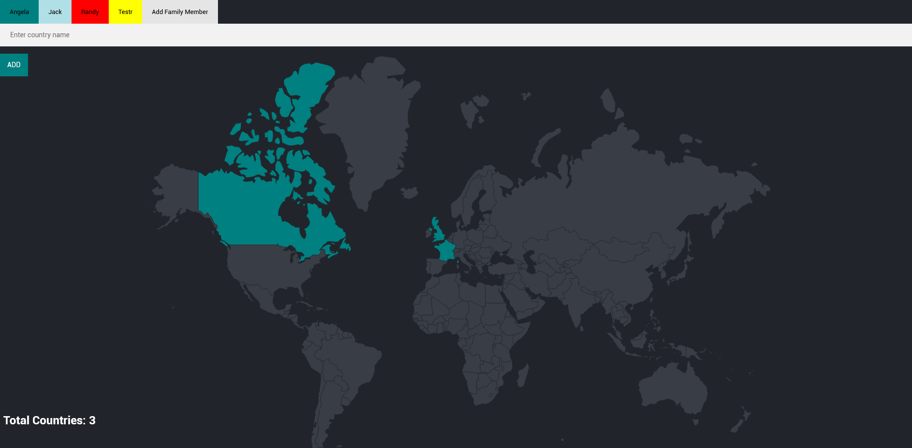
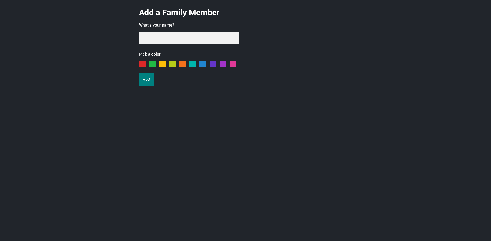

# Travel Tracker Application

## Introduction
The Travel Tracker is an interactive web application that allows users to track countries they have visited. Each user has a dedicated tab, and clicking on a country updates the database, highlighting the visited countries on the map.




## Database Schema
The application uses a PostgreSQL database with the following tables:

- **capitals**: Stores the capital cities of countries.
  - `id`: Primary key, integer
  - `country`: Name of the country, character varying(128)
  - `capital`: Name of the capital, character varying(128)

- **countries**: Contains a list of countries.
  - `id`: Primary key, integer
  - `country_code`: 2-letter country code, character(2)
  - `country_name`: Full name of the country, character varying(100)

- **users**: Keeps track of users of the application.
  - `id`: Primary key, integer
  - `name`: Name of the user, character varying(15)
  - `color`: Color preference for the user's UI, character varying(15)

- **visited_countries**: Records the countries visited by users.
  - `id`: Primary key, integer
  - `country_code`: 2-letter country code, character(2)
  - `user_id`: ID of the user, integer

## Prerequisites
- Node.js
- npm (Node Package Manager)
- PostgreSQL

## Installation

To install the project, follow these steps:

1. **Clone the Repository:**
   ```
   git clone https://github.com/artmedia1/Practice.git
   cd The Complete 2023 Web Development Bootcamp/Sections/Section 33 - PostgreSql/33.8 - Family Travel Tracker
   ```

2. **Install Dependencies:**
   ```
   npm install
   ```
   
3. **Database Setup:**
- Create a PostgreSQL database.
- Obtain your password for the database.
- Configure the `.env` file with your database settings:
  ```
  DATABASE=db_Name
  PASSWORD=db_Password
  ```

4. **Starting the Server:**
	To start the server, run:
   ```
   node index.js
   ```
 
 
## Usage
1. **Web Interface:**
- Launch the application by navigating to `http://localhost:[port]` (replace `[port]` with the port number specified in your configuration) in your web browser.
- Log in with a user-specific tab.
- Click on the countries you've visited to update the map and database.

2. **Manage Users:**
- Add or remove users and their respective tabs via the admin panel.

3. **View Progress:**
- Each country visited will be highlighted on the map.
- Track the total number of countries visited by each user.

## Acknowledgments
- Node.js and npm for the runtime and package management.
- PostgreSQL for database management.
- All other contributors and libraries that made this project possible.
